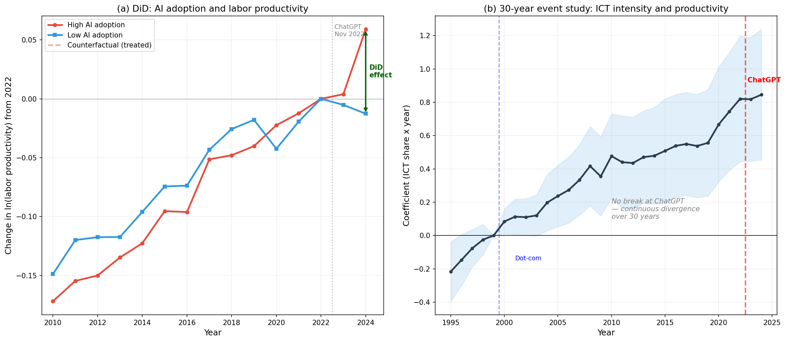
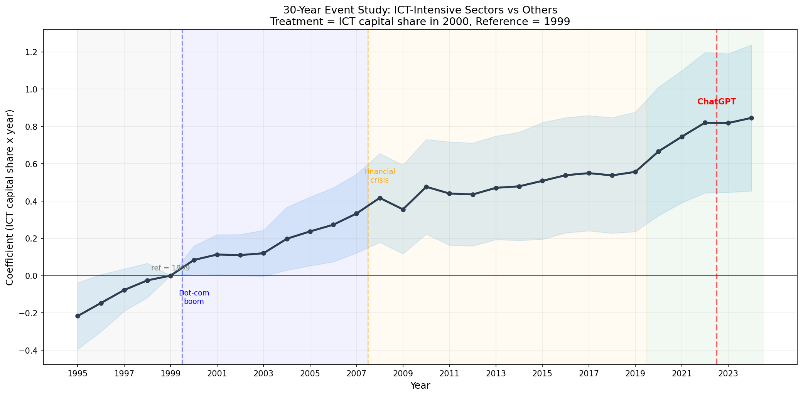
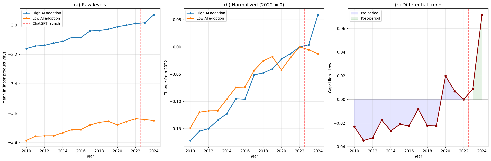

\newpage

# Introduksjon

Kunstig intelligens (KI) har på kort tid blitt et sentralt tema i diskusjonen om fremtidig produktivitetsvekst, organisering av arbeid og konkurranseevne. Teknologien omtales ofte som en general-purpose technology fordi den kan tas i bruk på tvers av oppgaver, virksomheter og næringer (Brynjolfsson & McAfee, 2014; Agrawal et al., 2019). Samtidig er det betydelig usikkerhet knyttet til hvor store de samlede økonomiske gevinstene faktisk vil bli. I den offentlige debatten varierer anslagene fra transformative makroøkonomiske effekter til mer moderate produktivitetsbidrag, og den empiriske litteraturen gir foreløpig ikke grunnlag for entydige konklusjoner.

Spennet i prognosene illustrerer denne usikkerheten. Goldman Sachs anslår at generativ KI kan øke globalt BNP med 7 prosent over en tiårsperiode (Hatzius et al., 2023), mens McKinsey estimerer et årlig verdiskapingspotensial på 17–26 billioner dollar (Chui et al., 2023). I den andre enden av prognosene mener Acemoglu (2024) med sitt eget oppgavebasert rammeverk beregner han at KI kan øke total faktorproduktivitet (TFP) i USA med om lag 0,66 prosent over de neste ti årene. Spriket mellom prognosene reflekterer ulike antakelser om hvor stor andel av økonomiens oppgaver som faktisk kan automatiseres lønnsomt, hvor store konstadsbesparelser vil være, teknologiens evne til å skape innovasjon, og teknologiens spredningsomfang.

En viktig grunn til denne usikkerheten er at produktivitetseffekter av ny teknologi ikke nødvendigvis materialiserer seg umiddelbart i aggregert statistikk. Dette er nært knyttet til det klassiske produktivitetsparadokset og til ideen om en produktivitets-J-kurve (Brynjolfsson et al., 2021): nye generelle teknologier krever ofte komplementære investeringer i organisering, kompetanse og immateriell kapital før gevinstene blir synlige i målte produktivitetstall. Historiske paralleller understøtter dette mønsteret. Da elektrisitet ble kommersielt tilgjengelig rundt 1890, tok det nærmere tre tiår før produktivitetseffektene viste seg i industristatistikken — først da fabrikker ble redesignet rundt den nye energikilden (David, 1990). IT-revolusjonen viste en tilsvarende forsinkelse fra introduksjonen av personlige datamaskiner tidlig på 1980-tallet til produktivitetsboomen fra midten av 1990-tallet. Robert Solow fanget dette paradokset allerede i 1987: «Du kan se datamaskinalderen overalt, bortsett fra i produktivitetsstatistikken» (kilde?)

Den empiriske litteraturen om KI og produktivitet opererer på ulike analysenivåer, og resultatene avhenger i stor grad av nivået. Aktiv bruk av KI blant den generelle konsument og i arbeidsprosesser er noe relativt nytt dette tiåret, og mye av den tidlige empirien for generativ KI er hentet fra avgrensede oppgaver og spesifikke arbeidsprosesser. Noy og Zhang (2023) finner i et randomisert eksperiment at tilgang til ChatGPT reduserer tidsbruken med 40 prosent og øker kvaliteten med 18 prosent i profesjonelle skriveoppgaver. Brynjolfsson et al. (2023) dokumenterer en 15 prosent økning i produktivitet blant kundeservicemedarbeidere med tilgang til et generativt KI-verktøy. Slike studier finner ofte betydelige produktivitetsgevinster, men de sier mindre om hvordan effektene akkumuleres på bedrifts-, nærings- eller makronivå. KI og arbeidsliv er en ung duo, men ting går fort.

Kanskje snakke om studier som bruker «exposure»

På bedriftsnivå har Czarnitzki et al. (2023) brukt tyske bedriftsdata med instrumentvariabelestimering og funnet en positiv og signifikant sammenheng mellom KI-adopsjon og bedriftsproduktivitet. Gao og Feng (2023) finner tilsvarende resultater med kinesiske industridata. Disse studiene har den identifikasjonsfordelen som bedriftsnivå-variasjon gir, men er begrenset til enkeltland og spesifikke næringer. På makro- og sektornivå er den empiriske evidensen mer begrenset. Den tidlige IKT-litteraturen har brukt stokastisk frontanalyse (SFA) til å studere teknologiens rolle som ineffektivitetsdeterminant i europeiske og amerikanske næringer (Dimelis & Papaioannou, 2011; Mastromarco et al., 2018). Vi vil også gjøre noe lignende i dette papiret.

Hvem er det som bruker KI? Og hvilke yrkesgrupper tilpasser seg først?

Undersøker om høyere KI-adopsjon er assosiert med høyere arbeidsproduktivitet og/eller høyere teknisk effektivitet i europeiske næringer.

## So far

Introduksjonen er ikke enda ferdig, kommer tilbake når oppgaven er mer utfoldet - kjedelig at forskningsspørsmålet og hypoteser med utspring fra papiret ikke kommer godt nok fram

- Derfor er det kjempevanskelig å peke på Solow-residualen og si: "Se! TFP gikk opp i 2024, dette beviser at ChatGPT fungerer!". Du vet ikke om det var KI, eller om det bare var et uvanlig godt år for bransjen.

Gir høyere KI-intensitet sterkere produktivitetsvekst? (dette er og burde være forskningsspørsmålet kanskje?)

\newpage

# Teori

her kan det være en liten tekst om. Produksjonsteori og klassisk definisjon av arbeidsproduktivitet

## Teoretisk rammeverk og litteratur

Utgangspunktet for analysen er den neoklassiske produksjonsfunksjonen, som beskriver sammenhengen mellom innsatsfaktorer og output. For en sektor $i$ i land $c$ på tidspunkt $t$ kan output skrives som:

$$Y_{ict} = A_{ict} \cdot F(L_{ict}, K_{ict})$$

der $Y_{ict}$ er brutto verdiskaping (GVA), $A_{ict}$ er total faktorproduktivitet (TFP), $L_{ict}$ er arbeidsinnsats (målt i timeverk) og $K_{ict}$ er kapitalbeholdningen. TFP fanger opp alt som påvirker output utover det som kan tilskrives økning i mengden arbeid og kapital — herunder teknologisk nivå, organisatorisk effektivitet og institusjonelle forhold.

Den mest brukte spesifikasjonen er Cobb-Douglas:

$$Y_{ict} = A_{ict} \cdot L_{ict}^{\alpha} \cdot K_{ict}^{\beta}$$

der $\alpha$ og $\beta$ er produksjonselastisitetene for henholdsvis arbeid og kapital. Dersom $\alpha + \beta = 1$, har vi konstant skalautbytte: en proporsjonal økning i begge innsatsfaktorer gir en tilsvarende proporsjonal økning i output. I log-lineær form gir dette:

$$\ln Y_{ict} = \ln A_{ict} + \alpha \ln L_{ict} + \beta \ln K_{ict}$$

Denne spesifikasjonen er grunnlaget for både panel fixed effects-estimering og stokastisk frontanalyse i denne oppgaven.

**Arbeidsproduktivitet**

Arbeidsproduktivitet defineres som output per enhet arbeidsinnsats:

$$LP_{ict} = \frac{Y_{ict}}{L_{ict}}$$

I log-form kan dette uttrykkes som:

$$\ln LP_{ict} = \ln Y_{ict} - \ln L_{ict} = \ln A_{ict} + (\alpha - 1) \ln L_{ict} + \beta \ln K_{ict}$$

Med konstant skalautbytte ($\alpha + \beta = 1$) forenkles dette til:

$$\ln LP_{ict} = \ln A_{ict} + \beta \ln \left(\frac{K_{ict}}{L_{ict}}\right)$$

Arbeidsproduktiviteten bestemmes altså av to faktorer: TFP ($A$) og kapitalintensiteten ($K/L$). Dersom KI øker arbeidsproduktiviteten, kan dette enten skje gjennom økt TFP (teknologisk fremgang) eller gjennom endret kapitalintensitet (substituering av arbeid med KI-kapital). I den empiriske analysen inkluderer jeg kapitalintensitet som kontrollvariabel for å isolere sammenhengen mellom KI og produktivitet utover det som kan forklares av forskjeller i kapitalutrustning.

**Total faktorproduktivitet og Solow-residualen**

TFP beregnes som en residual — den delen av outputveksten som ikke kan tilskrives vekst i arbeid og kapital:

$$\ln A_{ict} = \ln Y_{ict} - \alpha \ln L_{ict} - \beta \ln K_{ict}$$

Robert Solow (1957) var den første til å formalisere denne dekomponeringen. Residualen reflekterer alle produktivitetsfremmende faktorer: teknologisk innovasjon, forbedret organisering, mer effektiv ressursallokering, regulatorisk reform, og — potensielt — adopsjon av kunstig intelligens. Utfordringen med residualen er at den fanger opp alt vi ikke direkte måler, og det er derfor vanskelig å attribuere endringer i TFP til en enkelt faktor som KI.

Acemoglu (2024) adresserer dette ved å utvikle et rammeverk som dekomponerer TFP-endringer i bidrag fra spesifikke oppgaver som påvirkes av KI,

## Det oppgavebaserte rammeverket

**Produksjon som oppgaver**

Acemoglu og Restrepo (2018, 2022) og Acemoglu (2024) utvikler et rammeverk der produksjon forstås som utførelse av et sett oppgaver, snarere enn som en abstrakt kombinasjon av arbeid og kapital. I dette rammeverket produseres et sluttgode $Y$ ved å kombinere output fra et kontinuum av oppgaver $z \in [0, N]$:

$$Y = B(N) \left( \int_0^N y(z)^{\frac{\sigma-1}{\sigma}} dz \right)^{\frac{\sigma}{\sigma-1}}$$

der $y(z)$ er output fra oppgave $z$, $\sigma \geq 0$ er substitusjonselastisiteten mellom oppgaver, og $B(N)$ fanger opp systemeffekter av nye oppgaver. Acemoglu antar $\sigma \approx 0{,}5$, slik at oppgavene er komplementære — produksjonen er begrenset av den svakeste oppgaven.

Hver oppgave kan utføres av enten arbeidskraft eller kapital (inkludert KI):

$$y(z) = A_L \gamma_L(z) l(z) + A_K \gamma_K(z) k(z)$$

der $A_L$ og $A_K$ er faktorspesifikke produktivitetsparametre, $\gamma_L(z)$ og $\gamma_K(z)$ er oppgavespesifikke produktivitetsprofiler for henholdsvis arbeid og kapital, og $l(z)$ og $k(z)$ er innsatsen av arbeid og kapital i oppgave $z$. Innenfor en oppgave er arbeid og kapital perfekte substitutter, men de har ulik komparativ fordel på tvers av oppgaver.

**KI som teknologisjokk: fire kanaler**

I dette rammeverket kan KI påvirke produktiviteten gjennom fire distinkte kanaler (Acemoglu, 2024):

- **Automatisering** innebærer at KI overtar oppgaver som tidligere ble utført av arbeidskraft. Generativ KI kan for eksempel automatisere tekstsammendrag, dataklassifisering og mønstergjenkjenning. Dette reduserer kostnadene i de berørte oppgavene.
- **Oppgavekomplementaritet** oppstår når KI øker produktiviteten i oppgaver som ikke automatiseres fullt ut. Arbeidstakere som bruker KI-verktøy kan få bedre informasjonsgrunnlag, raskere tilbakemelding eller mulighet til å spesialisere seg i deloppgaver der de har komparativ fordel.
- **Fordypning av eksisterende automatisering** innebærer at KI forbedrer ytelsen i oppgaver som allerede er automatisert av tidligere teknologier.
- **Nye oppgaver** kan oppstå som følge av KI, og disse kan potensielt forbedre hele produksjonsprosessen.

Acemoglu (2024) fokuserer primært på de to første kanalene for generativ KI, og argumenterer for at fordypning av eksisterende automatisering er mindre relevant fordi oppgavene som påvirkes av generativ KI i stor grad er andre enn de som ble automatisert av roboter og industrisoftware.

**Fra oppgavenivå til aggregert TFP**

En sentral innsikt i rammeverket er at den samlede TFP-effekten kan uttrykkes som en vektet sum av kostnadsbesparelser på oppgavenivå. Med kapital og arbeid holdt fast viser Acemoglu (2024) at:

$$d \ln \text{TFP} = \int_0^N \chi(z) \pi_L(z) dz$$

der $\chi(z) = \frac{p(z) y(z)}{Y}$ er BNP-andelen til oppgave $z$ (Domar-vekten) og $\pi_L(z) = d \ln y(z)$ er produktivitetsforbedringen eller kostnadsbesparelsen i oppgaven drevet av KI. Denne formelen gjelder uavhengig av oppgavespesifikke produksjonsfunksjoner og fanger opp effekter fra både automatisering og oppgavekomplementaritet.

For praktisk beregning kan denne uttrykkes som:

$$d \ln \text{TFP} = \bar{\pi} \times \text{BNP-andel av oppgaver påvirket av KI}$$

der $\bar{\pi}$ er gjennomsnittlige totale kostnadsbesparelser. Arbeidskostnadsbesparelser $\pi_L$ konverteres til totale kostnadsbesparelser ved å multiplisere med arbeidsandelen i den aktuelle næringen: $\pi_i = s_L^i \cdot \pi_L^i$.

**Acemoglus anslag**

Acemoglu (2024) kalibrerer dette rammeverket med følgende parametere: basert på Eloundou et al. (2024) er om lag 20 prosent av amerikanske arbeidsoppgaver eksponert for KI. Justert for andelen som kan automatiseres lønnsomt innen ti år (23 prosent, fra Svanberg et al. 2024), gir dette en BNP-andel av påvirkede oppgaver på 4,6 prosent. Med gjennomsnittlige arbeidskostnadsbesparelser på 27 prosent (gjennomsnittet av Noy & Zhang 2023 og Brynjolfsson et al. 2023) og en eksponeringsbasert arbeidsandel på 0,535 gir dette totale kostnadsbesparelser på 14,4 prosent. Samlet anslår han:

$$d \ln \text{TFP} \approx 0{,}046 \times 0{,}144 \approx 0{,}0066$$

Altså en TFP-økning på 0,66 prosent over ti år. BNP-effekten, som inkluderer kapitalakkumulering, anslås til 0,93–1,56 prosent. Acemoglu understreker at selv dette kan være et øvre anslag, fordi mange av de eksponerte oppgavene er «vanskelige å lære» for KI, med lavere kostnadsbesparelser enn eksperimentstudiene antyder.

## Fra sektornivå til aggregat: Hultens teorem

**Teoremet**

Mens Acemoglus rammeverk opererer på oppgavenivå, analyserer denne oppgaven KI-adopsjon og produktivitet på sektornivå. For å forstå sammenhengen mellom sektorspesifikke produktivitetssjokk og aggregert BNP er Hultens teorem (1978) det sentrale resultatet.

Teoremet fastslår at for en effisient økonomi er førsteordenseffekten på BNP av et TFP-sjokk til en sektor $i$ lik sektorens salgsandel (Domar-vekt) $\lambda_i$:

$$\frac{d \ln C}{d \ln A_i} = \lambda_i$$

der $C$ er aggregert konsum (eller BNP) og $A_i$ er TFP i sektor $i$. Domar-vektene $\lambda_i$ defineres som sektorens bruttoproduksjon som andel av BNP, og kan overstige 1 for sektorer som selger mye som mellomprodukt til andre sektorer.

**Implikasjoner og begrensninger**

Hultens teorem innebærer at man — som førsteordens tilnærming — ikke trenger å kjenne den underliggende nettverksstrukturen i økonomien for å vurdere makroøkonomiske effekter av sektorsjokk. Det er tilstrekkelig å observere sektorens salgsandel. Baqaee og Farhi (2019) viser imidlertid at denne førsteordenstilnærmingen kan være villedende for store sjokk, spesielt i økonomier med sterke komplementariteter mellom sektorer. Andreordenseffektene avhenger av strukturelle substitusjonselastisiteter og nettverkskoblinger.

For denne oppgaven er Hultens teorem relevant fordi det gir teoretisk begrunnelse for å analysere produktivitet på sektornivå: dersom KI-adopsjon øker produktiviteten i en sektor, vil bidraget til aggregert BNP være proporsjonalt med sektorens størrelse i økonomien.

## Stokastisk frontanalyse (SFA)

**Grunnmodellen**

Stokastisk frontanalyse, introdusert uavhengig av Aigner, Lovell og Schmidt (1977) og Meeusen og van den Broeck (1977), er en økonometrisk metode for å estimere en produksjonsfront og samtidig dekomponere avvik fra fronten i to komponenter: tilfeldig støy og systematisk ineffektivitet.

I generell form skrives SFA-modellen som:

$$Y_{it} = f(X_{it}; \beta) \cdot \exp(v_{it} - u_{it}), \quad u_{it} \geq 0$$

der $f(X_{it}; \beta)$ er produksjonsfunksjonen med innsatsfaktorvektoren $X_{it}$ og parametervektor $\beta$, $v_{it}$ er et symmetrisk feilledd som fanger opp tilfeldig støy (målefeil, tilfeldige sjokk), og $u_{it}$ er et ikke-negativt ineffektivitetsledd som representerer avstanden fra den estimerte produksjonsfronten.

I log-lineær Cobb-Douglas-form blir dette:

$$\ln Y_{it} = \beta_0 + \beta_L \ln L_{it} + \beta_K \ln K_{it} + v_{it} - u_{it}$$

Støyleddet antas normalfordelt: $v_{it} \sim N(0, \sigma_v^2)$. Ineffektivitetsleddet antas å følge en ensidig fordeling, typisk halvnormal eller avkortet normal: $u_{it} \sim N^+(0, \sigma_u^2)$.

Teknisk effektivitet for observasjon $it$ defineres som:

$$TE_{it} = \exp(-u_{it}) \in (0, 1]$$

der $TE_{it} = 1$ innebærer full effektivitet (produksjon på fronten), mens verdier under 1 indikerer ineffektivitet.

**Identifikasjon**

Et naturlig spørsmål er hvordan modellen klarer å skille $v$ og $u$ statistisk, når ingen av dem observeres direkte. Identifikasjonen hviler på fordelingsantakelsene: fordi $u$ bare kan være ikke-negativ, blir det sammensatte feilleddet $\varepsilon = v - u$ skjevfordelt (venstreskjevt). Denne skjevheten identifiserer den relative størrelsen på ineffektivitetskomponenten. Maximum likelihood estimerer begge fordelingene simultant.

**Variasjonsparameteren gamma**

Et sentralt diagnosemål i SFA er parameteren:

$$\gamma = \frac{\sigma_u^2}{\sigma_v^2 + \sigma_u^2} \in [0, 1]$$

Gamma uttrykker andelen av total varians i det sammensatte feilleddet som kan tilskrives ineffektivitet. Dersom $\gamma \approx 1$, dominerer systematisk ineffektivitet — avvikene fra fronten er hovedsakelig systematiske. Dersom $\gamma \approx 0$, dominerer tilfeldig støy, og det finnes lite systematisk ineffektivitet å forklare. I sistnevnte tilfelle kollapser SFA til vanlig OLS, fordi dekomponeringen av feilleddet ikke tilfører informasjon utover det en standard regresjonsmodell gir.

Tolkningen av gamma har direkte konsekvenser for valg av metode: dersom gamma er nær null og ikke signifikant, er panel fixed effects en tilstrekkelig tilnærming. Dersom gamma er signifikant forskjellig fra null, tilfører SFA informasjon som FE ikke fanger.

**Battese–Coelli (1995): ineffektivitetsdeterminanter**

I den grunnleggende SFA-modellen er ineffektiviteten en uforklart residual. Battese og Coelli (1995) utvider modellen til å tillate at ineffektiviteten er en funksjon av observerbare variabler:

$$u_{it} = z_{it}' \delta + w_{it}, \quad w_{it} \geq -z_{it}' \delta$$

der $z_{it}$ er en vektor av variabler som kan forklare variasjon i ineffektivitet (i denne oppgaven: KI-adopsjon), $\delta$ er koeffisientvektoren, og $w_{it}$ er et residualt støyledd. Ineffektivitetsleddet $u_{it}$ antas å følge en avkortet normalfordeling med middelverdi $z_{it}' \delta$.

Fronten og ineffektivitetsligningen estimeres simultant med maximum likelihood. Tolkningen av koeffisientene i ineffektivitetsligningen er:

- Dersom $\delta_{\text{KI}} < 0$: høyere KI-adopsjon er assosiert med lavere ineffektivitet, altså høyere teknisk effektivitet $TE = \exp(-u)$.
- Dersom $\delta_{\text{KI}} > 0$: høyere KI-adopsjon er assosiert med høyere ineffektivitet, som kan reflektere implementeringskostnader eller omorganisering i en tidlig fase.

Det er viktig å presisere at $\delta_{\text{KI}}$ *ikke* er en produksjonselastisitet. Den beskriver ikke hvordan KI påvirker potensiell output (fronten), men hvordan KI samvarierer med avstanden mellom faktisk og potensiell produksjon.

**KI i fronten versus i ineffektivitetsligningen**

SFA-litteraturen skiller mellom to roller en teknologivariabel kan spille. Teknologien kan inngå direkte i produksjonsfunksjonen — altså flytte fronten oppover — eller den kan inngå i ineffektivitetsligningen og dermed påvirke hvor nær fronten enhetene opererer. Denne distinksjonen er eksplisitt diskutert i studier av IKT og produktivitet. Dimelis og Papaioannou (2011, 2017) og Mastromarco et al. (2018) finner at IKT primært reduserer teknisk ineffektivitet snarere enn å flytte fronten direkte, noe som motiverer valget om å plassere KI i ineffektivitetsligningen i denne oppgaven.

Begrunnelsen er at KI — i den aktuelle fasen av adopsjon — sannsynligvis påvirker produktiviteten gjennom prosessforbedring, bedre beslutningsstøtte og mer effektiv koordinering, snarere enn gjennom å fundamentalt endre produksjonsteknologien.

## Panel fixed effects og uobservert heterogenitet

**Paneldatamodellen**

Den mest direkte tilnærmingen til å estimere sammenhengen mellom KI og produktivitet er en paneldataregresjon med faste effekter. Hovedspesifikasjonen i denne oppgaven er:

$$\ln LP_{ict} = \alpha_c + \mu_i + \tau_t + \beta_1 \text{KI}_{ict} + \beta_2 \ln\left(\frac{K_{ict}}{L_{ict}}\right) + \varepsilon_{ict}$$

der $\ln LP_{ict}$ er log arbeidsproduktivitet i sektor $i$, land $c$ på tidspunkt $t$, $\alpha_c$ er landsfaste effekter, $\mu_i$ er sektorfaste effekter, $\tau_t$ er tidsfaste effekter, $\text{KI}_{ict}$ er KI-adopsjonsraten og $K/L$ er kapitalintensiteten.

De faste effektene absorberer all tidskonstant uobservert heterogenitet mellom land (institusjonelle forskjeller, regulering, kultur) og mellom sektorer (teknologisk nivå, markedsstruktur, arbeidsorganisering). Tidsfaste effekter fanger opp sjokk som er felles for alle sektorer og land i et gitt år, som globale konjunkturbevegelser eller teknologitrender.

**Uobservert heterogenitet**

Hill et al. (2018) drøfter utfordringen med uobservert heterogenitet i paneldata. Hvert land og hver sektor har unike egenskaper som er vanskelige eller umulige å måle — for eksempel kvaliteten på institusjonell styring, ledelseskultur i næringen, eller historisk teknologiposisjon. Dersom disse uobserverbare faktorene er korrelert med KI-adopsjon (som er sannsynlig — produktive og godt styrte sektorer adopterer trolig KI raskere), vil en OLS-estimering uten faste effekter gi forventningsskjeve estimater.

Paneldatamodellen med faste effekter løser dette ved å differensiere vekk den tidskonstante heterogeniteten. Estimatoren identifiserer $\beta_1$ utelukkende fra *variasjon over tid innenfor* hvert land-sektor-par — altså fra endringer i KI-adopsjon og korresponderende endringer i produktivitet for den samme sektoren i det samme landet.

**Difference-estimatoren**

En ytterligere styrke ved paneldata er muligheten til å estimere modellen direkte i differanser:

$$\Delta \ln LP_{ict} = \beta_1 \Delta \text{KI}_{ict} + \beta_2 \Delta \ln\left(\frac{K_{ict}}{L_{ict}}\right) + \eta_{ict}$$

Denne spesifikasjonen eliminerer *alle* tidskonstante faktorer og utnytter kun endringer over tid. Dersom $\beta_1$ er signifikant i denne spesifikasjonen, innebærer det at sektorer som øker sin KI-adopsjon også opplever høyere produktivitetsvekst — en sterkere indikasjon enn nivå-assosiasjonen alene.

## Difference-in difference med lang produktivitetsserie

Standard panel FE utnytter kun de tre årene med KI-data (2021, 2023, 2024). Men GVA og sysselsetting er tilgjengelig tilbake til 2010, noe som gir 14 år med produktivitetsdata. Denne asymmetrien kan utnyttes i et difference-in-differences-design (DiD) der den lange tidsserien brukes til å etablere pre-trender og den korte KI-serien definerer behandlingsintensiteten.

**Designet**

Behandlingsintensiteten defineres som gjennomsnittlig endring i KI-adopsjon fra 2021 til 2024 per sektor, beregnet som tverrsnittsgjennomsnitt over land. Denne variabelen, $\Delta \overline{\mathrm{KI}}_i$, er tidskonstant og fanger hvor mye sektoren har adoptert KI i løpet av ChatGPT-perioden. Post-perioden defineres som 2023 og 2024 --- årene etter at ChatGPT ble lansert i november 2022.

Spesifikasjonen er:

$$\ln LP_{ict} = \alpha_{ic} + \tau_t + \beta \left( \Delta \overline{\mathrm{KI}}_i \times \mathrm{Post}_t \right) + \varepsilon_{ict}$$

der $\alpha_{ic}$ er faste effekter for hvert land$\times$sektor-par og $\tau_t$ er tidsfaste effekter. Interaksjonsleddet $\Delta \overline{\mathrm{KI}}_i \times \mathrm{Post}_t$ er null i pre-perioden (2010--2022) og lik $\Delta \overline{\mathrm{KI}}_i$ i post-perioden (2023--2024). Koeffisienten $\beta$ måler om sektorer med sterkere KI-adopsjonsvekst opplever differensiell produktivitetsendring etter ChatGPT-lanseringen.

Designet har tre fordeler sammenlignet med standard FE. For det første tidobles antall observasjoner (fra \~1200 til \~12 000). For det andre absorberer land$\times$sektor-interaksjonseffektene all tidskonstant heterogenitet --- ikke bare land- og sektoreffektene separat. For det tredje er behandlingsvariabelen forhåndsdefinert og varierer ikke over tid, noe som reduserer samtidighetsbias.

## Sammendrag

Når vi føler at papiret har tilstrekkelig teori, data, og metode lager vi sammendrag for kapitellet.

- ingen av disse tilnærmingene identifiserer kausale effekter i streng forstand. Sektornivådata er for aggregert til å kontrollere for alle konfunderende faktorer, KI-variabelen fanger ikke opp intensitet i bruken, og tidsserien er kort. Det empiriske bidraget ligger i å dokumentere systematiske assosiasjoner i et bredt europeisk panel med flere komplementære metoder.

Det er jo også slik at vi i skrivende øyeblikk jobber med data og metode, så teorikapitlet kan alltids omskriver og ompasses.

\newpage

# Data

**-Beskrivelse**

```{r Biblotek}
#Libraries 


library(eurostat)   # henter data direkte fra Eurostat
library(dplyr)      # filtrering, mutering, joins
library(tidyr)      # omforming og håndtering av manglende verdier
library(stringr)    # strenghåndtering, nyttig ved NACE-koder
library(janitor)    # clean_names() og ryddigere datastruktur
library(ggplot2)    # enkle deskriptive figurer
library(knitr)      # kable()-tabeller i Quarto
library(readr)      # evt. lagring/innlesing av lokale filer
library(here)       # robuste filstier i prosjektmappe


```

Datagrunnlaget for oppgaven henter fra Eurostats. Eurostat er EUs statistiske kontor og koordinerer innsamlingen av statistikk fra de nasjonale statistikkbyråene i medlemsland og assosierte land. I oppgaven bruker vi fire tabeller som dekker; KI-adopsjon i foretak, brutto verdiskapning, sysselsetting og kapitalbeholdning - alle etter næring og land som vi ønsker å kobles på felles nøkler (land, NACE Rev. 2-næringskode og år) til et paneldatasett for økonometrisk analyse.

Alle tabeller hentes direkte via Eurostats API gjennom R-pakken `eurostat` (Lahti et al., 2017). De påfølgende avsnittene presenterer hver tabell, dokumenterer variabelvalg og viser den faktiske strukturen i dataene.

| Tabell         | Innhold                   | Hovedvariabel | Enhet      |
|----------------|---------------------------|---------------|------------|
| isoc_eb_ain2   | KI-adopsjon i foretak     | E_AI_TANY     | PC_ENT     |
| nama_10_a64    | Brutto verdiskaping (GVA) | B1G           | CLV20_MEUR |
| nama_10_a64_e  | Arbeidsinnsats            | EMP_DC        | THS_HW     |
| nama_10_nfa_st | Kapitalbeholdning         | N11N          | CLV20_MEUR |

### KI-adopsjon: isoc_eb_ain2

Datasettet inngår i den årlige felleskapsundersøkelsen om IKT-bruk i foretak. IKT-undersøkelsen har vært gjennomført årlig siden 2002 og ble utvidet med et eget modulsett for kunstig intelligens fra og med 2021-undersøkelsen.

```{r}
ai_raw <- get_eurostat("isoc_eb_ain2", time_format = "num")
saveRDS(ai_raw, "data/ai_raw.rds")
```

Tabellen er et flerdimensjonalt datasett der hver observasjon er definert av seks dimensjoner:

```{r}
cat("Dimensjoner:\n")
cat("  freq:     ", paste(unique(ai_raw$freq), collapse=", "), "\n")
cat("  size_emp: ", paste(unique(ai_raw$size_emp), collapse=", "), "\n")
cat("  nace_r2:  ", length(unique(ai_raw$nace_r2)), "næringskoder\n")
cat("  indic_is: ", length(unique(ai_raw$indic_is)), "indikatorer\n")
cat("  unit:     ", paste(unique(ai_raw$unit), collapse=", "), "\n")
cat("  geo:      ", length(unique(ai_raw$geo)), "geografiske enheter\n")
cat("  År:       ", paste(sort(unique(ai_raw$TIME_PERIOD)), collapse=", "), "\n")
```

Frekvensen er årlig (`A`) og størrelsesklassen er utelukkende foretak med ti eller flere ansatte (`GE10`). Disse to dimensjonene er konstante og kan fjernes. Variabelen `values` inneholder den observerte verdien for den aktuelle kombinasjonen av dimensjoner

```{r}
ai_full <- ai_raw %>%
  rename(
    country      = geo,
    industry     = nace_r2,
    year         = TIME_PERIOD,
    ai_indicator = indic_is,
    measure_unit = unit,
    value        = values
  ) %>%
  select(-freq, -size_emp)
```

**Indikatorer og måleenheter**

Tabellen inneholder 63 indikatorer som dekker fire dimensjoner av KI-bruk: hvilke teknologier foretakene benytter (for eksempel språkgenerering, maskinlæring, bildegjenkjenning), hvilke formål KI brukes til (markedsføring, produksjon, administrasjon, logistikk), hvordan teknologien er anskaffet (egenutviklet, kommersiell, åpen kildekode) og barrierer mot adopsjon (kostnader, kompetansemangel, personvern).

```{r}
print(ai_full %>%
  count(measure_unit, sort = TRUE))
```

```{r}
summary(ai_full)
```

Måleenhetene uttrykker andeler med ulike referansepopulasjoner. `PC_ENT` er andelen av *alle* foretak med ti eller flere ansatte — den bredeste og mest sammenlignbare referansen. `PC_ENT_AI_TANY` er andelen blant foretak *som allerede bruker KI*. `PC_ENT_IUSE` bruker foretak med internettilgang som nevner. I denne analysen brukes gjennomgående **PC_ENT**.

Hovedindikatoren er **E_AI_TANY**: andelen foretak som bruker *minst én* av de definerte KI-teknologiene. Denne fanger den ekstensive marginen — om foretaket i det hele tatt bruker KI. Den komplementære indikatoren E_AI_TX fanger andelen som ikke bruker noen KI.

Hovedindikatoren er **E_AI_TANY**: andelen foretak som bruker *minst én* av de definerte KI-teknologiene. Denne fanger den ekstensive marginen — om foretaket i det hele tatt bruker KI. Den komplementære indikatoren E_AI_TX fanger andelen som ikke bruker noen KI.

```{r}
ai_model <- ai_full %>%
  filter(
    !country %in% c("EU27_2020", "EA", "EA12", "EA19", "EA20", "EA21"),
    ai_indicator == "E_AI_TANY",
    measure_unit == "PC_ENT"
  ) %>%
  select(country, industry, year, value) %>%
  rename(ai_adopt = value)

cat("Observasjoner: ", nrow(ai_model), "\n")
cat("Land:          ", n_distinct(ai_model$country), "\n")
cat("Næringskoder:  ", n_distinct(ai_model$industry), "\n")
cat("År:            ", paste(sort(unique(ai_model$year)), collapse=", "), "\n")
```

Etter filtrering på E_AI_TANY og PC_ENT, og etter fjerning av EU- og eurosone-aggregater, gjenstår 34 land.

**Tidsstruktur**

Tabellen inneholder data for referanseårene 2021, 2023, 2024 og 2025. Året 2022 er ikke tilgjengelig — KI-modulen ble inkludert i 2021-undersøkelsen, utelatt fra 2022-undersøkelsen og gjenopptatt som fast modul fra 2023.Tidssavstanden mellom de to første observasjonene er dermed to år (2021-2023), mens de påfølgende intervallene er ett år.

**Næringskoder**

Variabelen `industry` inneholder 50 NACE-koder fordelt på fire aggregeringsnivåer: brede seksjonskoder (C, D, G), mellomaggregater (C-E, C10-C18), detaljerte næringsgrupper (C10-C12, G45, J62_J63) og spesialaggregater (ICT, C10-S951_X_K). Disse nivåene overlapper — C er lik summen av C10-C12, C13-C15, ..., C31-C33.

```{r}
sort(unique(ai_model$industry))
```

For økonometrisk analyse kreves et sett næringer som er gjensidig utelukkende. Å inkludere både C og C10-C12 ville innebære dobbeltregning av industrisektoren. Utvalget av næringer diskuteres i avsnitt 3.5 etter at alle fire tabeller er presentert. Til slutt er en annen avgrensing at finanssektoren (NACE K) er ekskludert fra IKT-datasettene.

```{r}
summary(ai_model)
```

**KI-adopsjon: hovedtrekk**

Gjennomsnittlig KI-adopsjon øker moderat fra 2021 til 2023 og markant fra 2023 til 2024. Denne akselerasjonen kan dekomponeres på teknologitype. Tabellen viser utviklingen for industrisektoren samlet (NACE C):

```{r}
ai_model %>%
  filter(!is.na(ai_adopt)) %>%
  group_by(year) %>%
  summarise(
    n = n(),
    gjennomsnitt = round(mean(ai_adopt, na.rm = TRUE), 1),
    median = round(median(ai_adopt, na.rm = TRUE), 1),
    std = round(sd(ai_adopt, na.rm = TRUE), 1)
  )
```

```{r}
ai_tech <- ai_full %>%
  filter(
    !country %in% c("EU27_2020", "EA"),
    measure_unit == "PC_ENT",
    industry == "C",
    ai_indicator %in% c("E_AI_TANY", "E_AI_TNLG", "E_AI_TTM",
                         "E_AI_TML", "E_AI_TPA", "E_AI_TAR")
  ) %>%
  group_by(year, ai_indicator) %>%
  summarise(gjennomsnitt = round(mean(value, na.rm = TRUE), 1), .groups = "drop") %>%
  pivot_wider(names_from = year, values_from = gjennomsnitt)

ai_tech
```

Vi ser et hopp i utviklingen i de fleste KI-teknologiene.

**Mulige problemmer**

- Over 1000 na's

- Mengden ligger sikkert i Luxemburg

### Brutto verdiskapning: nama_10_a64

Output måles som brutto verdiskaping (GVA) fra Eurostats nasjonalregnskapstabell *nama_10_a64* (Annual national accounts by 64 branches). Tabellen inneholder detaljerte nasjonalregnskapsdata etter næring og er en del av European System of Accounts (ESA 2010).

```{r}
gva_raw <- get_eurostat("nama_10_a64", time_format = "num")
saveRDS(gva_raw, "data/gva_raw.rds")

cat("Dimensjoner:\n")
cat("  na_item: ", paste(sort(unique(gva_raw$na_item)), collapse=", "), "\n")
cat("  unit:    ", length(unique(gva_raw$unit)), "enheter\n")
cat("  nace_r2: ", length(unique(gva_raw$nace_r2)), "næringskoder\n")
cat("  geo:     ", length(unique(gva_raw$geo)), "land\n")
cat("  År:      ", min(gva_raw$TIME_PERIOD), "-", max(gva_raw$TIME_PERIOD), "\n")
```

Tabellen inneholder flere nasjonalregnskapsstørrelser:

```{r}
sort(unique(gva_raw$na_item))
```

Variabelen **B1G** gir brutto verdiskaping, definert som bruttoproduksjon (P1) minus produktinnsats (P2). GVA representerer verdien som skapes i selve produksjonsprosessen og er det foretrukne outputmålet for produktivitetsanalyse fordi det — i motsetning til bruttoproduksjon — ikke blåses opp av mellomprodukthandel.

Tabellen tilbyr GVA i en rekke prisenheter:

```{r}
gva_raw %>%
  filter(na_item == "B1G") %>%
  count(unit, sort = TRUE) %>%
  head(8)
```

I denne analysen brukes **CLV20_MEUR**: *chained volumes*(kjedede volumer?) i millioner euro med 2020 som referanseår. Kjedede volumer korrigerer for prisendringer over tid og muliggjør sammenligning mellom land i en felles valuta. Alternativet CP_MEUR (løpende priser) ville blande priseffekter med volumeffekter og er uegnet for produktivitetsmåling.

```{r}
gva_clean <- gva_raw %>%
  rename(country = geo, industry = nace_r2, year = TIME_PERIOD, value = values) %>%
  filter(
    !country %in% c("EU27_2020", "EA", "EA12", "EA19", "EA20", "EA21"),
    na_item == "B1G",
    unit == "CLV20_MEUR"
  ) %>%
  # Harmoniser D → D35 og L → L68 (identiske verdier, verifisert)
  mutate(industry = case_when(
    industry == "D" ~ "D35",
    industry == "L" ~ "L68",
    TRUE ~ industry
  )) %>%
  distinct(country, industry, year, .keep_all = TRUE) %>%
  select(country, industry, year, value) %>%
  rename(gva = value) %>%
  filter(!is.na(gva))

cat("GVA observasjoner: ", nrow(gva_clean), "\n")
cat("Land:              ", n_distinct(gva_clean$country), "\n")
cat("År:                ", min(gva_clean$year), "-", max(gva_clean$year), "\n")
```

Tabellen dekker perioden 1975–2025, men tilgjengeligheten for de siste årene varierer. For 2024 rapporterer 33 land. For 2025 har kun Malta rapportert ved skrivingstidspunktet.

Et teknisk poeng er harmoniseringen av næringskodene D og D35 samt L og L68. KI-tabellen bruker de detaljerte kodene D35 (elektrisitet, gass og varmtvannsforsyning) og L68 (omsetning og drift av fast eiendom), mens nasjonalregnskapstabellen i noen tilfeller rapporterer de bredere seksjonskodene D og L. Fordi seksjon D kun inneholder næring D35 og seksjon L kun inneholder L68, er verdiene identiske — dette er verifisert for alle land. I datakonstruksjonen kodes D om til D35 og L til L68, etterfulgt av deduplisering for å unngå dobbeltregistrering i land der begge koder rapporteres.

```{r}
summary(gva_clean)
```

**mulige problemer**

- Sjekke harmonisering mot ai_model og ha samme industry

- Mangler sikkert data på andre siden av tidsskalaen også. Kanskje starte fra 2010 ellerno

- Det er virkelig i modelens interesse at vi kutter 2025?

### Arbeidsinnsats (sysselsetting): nama_10_a64_e

Arbeidsinnsats hentes fra Eurostats tabell *nama_10_a64_e* (National accounts employment data by 64 branches). Tabellen inneholder tre typer arbeidsmål fordelt på tre telleenheter.

```{r}
emp_raw <- get_eurostat("nama_10_a64_e", time_format = "num")
saveRDS(emp_raw, "data/emp_raw.rds")

cat("Arbeidsmål (na_item):\n")
print(sort(unique(emp_raw$na_item)))
cat("\nTelleenheter (unit):\n")
print(sort(unique(emp_raw$unit)))
```

Arbeidsmålene er EMP_DC (total sysselsetting, domestic concept), SAL_DC (lønnsmottakere) og SELF_DC (selvstendig næringsdrivende). Telleenhetene er THS_PER (tusen personer), THS_JOB (tusen jobber) og THS_HW (tusen timeverk), i tillegg til prosentvise endringsrater.

I denne analysen brukes **EMP_DC** (total sysselsetting) med **THS_HW** (tusen timeverk). Timeverk foretrekkes som mål på faktisk arbeidsinput. Antall sysselsatte skiller ikke mellom heltid og deltid, og antall jobber fanger ikke opp forskjeller i arbeidstid mellom land og sektorer. For eksempel jobber ansatte i norsk industri gjennomsnittlig færre timer enn ansatte i polsk industri — en forskjell som reflekteres i timeverksmålet men ikke i persontallet.

Arbeidsproduktiviteten beregnes deretter som $LP_{ict} = GVA_{ict} / L_{ict}$, der $L$ er timeverk.

```{r}
emp_clean <- emp_raw %>%
  rename(country = geo, industry = nace_r2, year = TIME_PERIOD, value = values) %>%
  filter(
    !country %in% c("EU27_2020", "EA", "EA12", "EA19", "EA20", "EA21"),
    na_item == "EMP_DC",
    unit == "THS_HW"
  ) %>%
  mutate(industry = case_when(
    industry == "D" ~ "D35",
    industry == "L" ~ "L68",
    TRUE ~ industry
  )) %>%
  distinct(country, industry, year, .keep_all = TRUE) %>%
  select(country, industry, year, value) %>%
  rename(hours = value) %>%
  filter(!is.na(hours))

cat("EMP observasjoner: ", nrow(emp_clean), "\n")
cat("Land:              ", n_distinct(emp_clean$country), "\n")
```

```{r}
summary(emp_clean)
```

### Kapitalbeholdning: nama_10_nfa_st

Kapitalbeholdningen hentes fra Eurostats tabell *nama_10_nfa_st* (Annual sector accounts — non-financial assets by industry), som inneholder data om beholdningen av ikke-finansielle aktiva etter aktivatype, næring og land. Tabellen er del av nasjonalregnskapet under ESA 2010 og dekker perioden 1975–2024.

```{r}
cap_raw <- get_eurostat("nama_10_nfa_st", time_format = "num")
saveRDS(cap_raw, "data/cap_raw.rds")

cat("Dimensjoner:\n")
cat("  asset10: ", length(unique(cap_raw$asset10)), "aktivatyper\n")
cat("  unit:    ", length(unique(cap_raw$unit)), "enheter\n")
cat("  nace_r2: ", length(unique(cap_raw$nace_r2)), "næringskoder\n")
cat("  geo:     ", length(unique(cap_raw$geo)), "land\n")
cat("  År:      ", min(cap_raw$TIME_PERIOD, na.rm = TRUE), "-",
    max(cap_raw$TIME_PERIOD, na.rm = TRUE), "\n")
```

**Aktivatyper**

Tabellen inneholder 28 aktivatyper som er organisert i et hierarki. Hver type rapporteres i bruttobeholdning (suffikset G) og nettobeholdning (suffikset N):

```{r}
sort(unique(cap_raw$asset10))
```

Hovedkategoriene er N11 (samlet fast realkapital), N111 (boliger), N112 (andre bygninger og konstruksjoner), N1131 (transportmidler), N1132 (IKT-utstyr og annet maskineri), N115 (dyrket biologiske ressurser) og N117 (immaterielle eiendeler inkludert programvare og databaser). Hver av disse finnes i brutto (G) og netto (N) versjon.

I denne analysen brukes **N11N** — netto fast realkapital. Nettobeholdningen er bruttobeholdningen fratrukket akkumulerte avskrivninger og representerer den gjenstående produktive verdien av kapitalen. Bruttobeholdningen (N11G) ville overvurdere den faktiske kapasiteten fordi den teller fullt ut med også kapital som er betydelig avskrevet.

**Prisenheter**

```{r}
sort(unique(cap_raw$unit))
```

Tabellen tilbyr fire prisenheter, hver i euro og nasjonal valuta: kjedede volumer med 2015 som referanseår (CLV15), kjedede volumer med 2020 som referanseår (CLV20), gjenanskaffelseskostnad i løpende priser (CRC) og foregående års priser (PYR).

I denne analysen brukes **CLV20_MEUR** — kjedede volumer i millioner euro med 2020 som referanseår — konsistent med valget for GVA. *Chain volumes* for kapitalbeholdning er analytisk viktig fordi løpende priser (CRC) blåser opp kapitalverdien i perioder med prisvekst uten at den underliggende fysiske kapitalbeholdningen endres.

**Filtrering og harmonisering**

```{r}
cap_clean <- cap_raw %>%
  rename(country = geo, industry = nace_r2, year = TIME_PERIOD, value = values) %>%
  filter(
    !country %in% c("EU27_2020", "EA", "EA12", "EA19", "EA20", "EA21"),
    asset10 == "N11N",
    unit == "CLV20_MEUR"
  ) %>%
  mutate(industry = case_when(
    industry == "D" ~ "D35",
    industry == "L" ~ "L68",
    TRUE ~ industry
  )) %>%
  distinct(country, industry, year, .keep_all = TRUE) %>%
  select(country, industry, year, value) %>%
  rename(capital = value) %>%
  filter(!is.na(capital), capital > 0)

cat("Observasjoner: ", nrow(cap_clean), "\n")
cat("Land:          ", n_distinct(cap_clean$country), "\n")
cat("Næringskoder:  ", n_distinct(cap_clean$industry), "\n")
```

Som for GVA- og sysselsettingstabellene harmoniseres D til D35 og L til L68, etterfulgt av deduplisering. Et lite antall observasjoner med kapital lik null eller negativ verdi fjernes — disse forekommer kun i enkeltsektorer på 1990-tallet og skyldes regnskapstekniske omlegginger.

**Dekningsgrad over tid**

Kapitaltabellen er begrenset.

```{r}
cap_clean %>%
  filter(year >= 2020) %>%
  group_by(year) %>%
  summarise(
    land = n_distinct(country),
    obs  = n()
  )
```

For 2021 og 2022 rapporterer 28 land. For 2023 faller dekningen til 26 land — Norge og Bulgaria mangler. For 2024 har kun 13 land rapporter

```{r}
cap_clean %>%
  filter(year == 2024) %>%
  distinct(country) %>%
  arrange(country) %>%
  pull(country)
```

Landene som mangler 2024-kapital inkluderer flere sentrale europeiske økonomier som Spania, Sverige, Hellas, Polen og Romania, i tillegg til Norge (vi har ssb data da).

**Lagget kapitalbeholdning**

Kapitalbeholdningen er en treg størrelse. Den bestemmes av den akkumulerte investeringshistorien fratrukket avskrivninger, og fra ett år til det neste endrer den seg primært gjennom netto investeringer (bruttoinvesteringer minus avskrivninger). I datasettet kan vi måle denne tregheten direkte:

```{r}
cap_change <- cap_clean %>%
  arrange(country, industry, year) %>%
  group_by(country, industry) %>%
  mutate(
    pct_change = (capital - lag(capital)) / lag(capital) * 100
  ) %>%
  ungroup() %>%
  filter(!is.na(pct_change), year >= 2018)

cat("Årlig prosentendring i netto kapitalbeholdning (2018–2024):\n")
summary(cap_change$pct_change)
cat("\nKvartiler:\n")
cat("  25%: ", quantile(cap_change$pct_change, 0.25), "%\n")
cat("  50%: ", quantile(cap_change$pct_change, 0.50), "%\n")
cat("  75%: ", quantile(cap_change$pct_change, 0.75), "%\n")
```

Median årlig endring er om lag 1,2 prosent, og interkvartilbredden strekker seg fra −0,7 til 3,4 prosent. Den store majoriteten av land-sektor-kombinasjoner opplever altså en endring på under 4 prosent per år.

Denne tregheten gjør det forsvarlig å bruke kapitalbeholdningen fra nærmeste tilgjengelige forutgående år som proxy der eksakte data mangler (carry-forward). Strategien er som følger: for hvert analyseår $t$ brukes $K_t$ der tilgjengelig. Dersom $K_t$ mangler, brukes $K_{t-1}$, og dersom også denne mangler, brukes $K_{t-2}$. Maksimalt etterslep er to år.

```{r}
fill_capital <- function(target_year, cap_data, max_lag = 2) {
  filled <- NULL
  for (lag in 0:max_lag) {
    source_year <- target_year - lag
    available <- cap_data %>%
      filter(year == source_year) %>%
      select(country, industry, capital) %>%
      mutate(cap_lag = lag)
    if (is.null(filled)) {
      filled <- available
    } else {
      already_covered <- filled %>% select(country, industry)
      new_obs <- available %>%
        anti_join(already_covered, by = c("country", "industry"))
      filled <- bind_rows(filled, new_obs)
    }
  }
  filled %>% mutate(year = target_year)
}

cap_filled <- bind_rows(
  fill_capital(2021, cap_clean),
  fill_capital(2023, cap_clean),
  fill_capital(2024, cap_clean)
)
```

Resultatet av denne strategien er:

```{r}
cat("Lag-fordeling per analyseår:\n")
table(cap_filled$cap_lag, cap_filled$year)
```

For 2021 brukes eksakt kapital for alle observasjoner (lag = 0). For 2023 brukes 2022-kapital som proxy for Norge og Bulgaria (lag = 1). For 2024 brukes eksakt kapital for de 13 landene som har rapportert, 2023-kapital for ytterligere land (lag = 1), og 2022-kapital for Norge og Bulgaria (lag = 2). En variabel cap_lag registrerer antall års etterslep for hver observasjon. Denne gjør det mulig å teste robustheten av resultatene ved å begrense analysen til kun observasjoner med eksakt match (lag = 0) — et utvalg som da ekskluderer blant annet Norge. Lag-strategien introduserer en form for klassisk målefeil: den faktiske kapitalen i et gitt år avviker fra den laggede proxyen. Fordi kapitalbeholdningen inngår som kontrollvariabel (kapitalintensitet K/LK/L K/L) og ikke som avhengig variabel, vil denne målefeilen primært medføre en demping av koeffisienten for kapitalintensitet mot null (attenuation bias). Effekten på KI-koeffisienten er mindre direkte og avhenger av korrelasjonen mellom målefeilen og KI-adopsjon.

**Mulige problemer**

- Får vi harmonisert på riktig unit? Er det felles best for alle å bruke CLV2020 eller 2015? Hva gir best dekning?

- Burde alle tabellene utenom ai_adopt være satt fra 2010-2025 hvis mulig?

- klarer du selv å laste inn å sammenligne all dataen?

- Hvorfor skal vi lagge kapitalserien og ikke de andre?

- Hvordan ungår vi flest mulige NA's? - Vil det da hjelpe å fjerne Luxemburg?

- Det er svært viktig at vi tar alt mulig i betrakning før vi konstruerer de aggregerte modellene.

### Aggregert tabell

Alle fire tabeller inneholder NACE-koder på flere aggregeringsnivåer som overlapper hverandre. For å bygge et panel uten dobbeltregning trengs et sett næringer som er gjensidig utelukkende og — så langt det lar seg gjøre — uttømmende innenfor ICT-undersøkelsens dekningsområde.

Prinsippet er: bruk detaljerte koder der KI-tabellen tilbyr dem, brede seksjonskoder der det er eneste alternativ. For industri (C) velges 13 detaljerte grupper i stedet for den brede koden C. For handel (G) velges G45, G46 og G47. For IKT (J) velges J58-J60, J61 og J62_J63. For faglig tjenesteyting (M) velges M69-M71, M72 og M73-M75. For sektorer der kun den brede koden er tilgjengelig i KI-tabellen — E, F, H, I og N — beholdes denne. For D og L velges de mer presise kodene D35 og L68.

```{r}
industry_keep <- c(
  # Industri — 13 detaljerte grupper
  "C10-C12", "C13-C15", "C16-C18", "C19", "C20", "C21",
  "C22_C23", "C24_C25", "C26", "C27", "C28", "C29_C30", "C31-C33",
  # Forsyning, vann, bygg
  "D35", "E", "F",
  # Handel — 3 detaljerte grupper
  "G45", "G46", "G47",
  # Transport, overnatting
  "H", "I",
  # IKT — 3 detaljerte grupper
  "J58-J60", "J61", "J62_J63",
  # Eiendom
  "L68",
  # Faglig tjenesteyting — 3 detaljerte grupper
  "M69-M71", "M72", "M73-M75",
  # Administrativ tjenesteyting
  "N"
)

cat(length(industry_keep), "sektorer valgt\n")
```

Vi verifiserer at alle 29 koder finnes i alle fire tabeller:

```{r}
ai_nace   <- sort(unique(ai_model$industry))
gva_nace  <- sort(unique(gva_clean$industry))
emp_nace  <- sort(unique(emp_clean$industry))
cap_nace  <- sort(unique(cap_clean$industry))

# Sjekk hva som mangler per tabell
cat("Mangler i KI:     ", setdiff(industry_keep, ai_nace), "\n")
cat("Mangler i GVA:    ", setdiff(industry_keep, gva_nace), "\n")
cat("Mangler i EMP:    ", setdiff(industry_keep, emp_nace), "\n")
cat("Mangler i kapital:", setdiff(industry_keep, cap_nace), "\n")
```

Samtlige 29 koder finnes i alle fire tabeller etter harmoniseringen D→D35 og L→L68. Utvalget ekskluderer primærnæringene (A), bergverk (B), finanssektoren (K, som ikke dekkes av ICT-surveyen), offentlig forvaltning (O–Q) og øvrige tjenesteytende næringer (R–U). Disse sektorene faller utenfor enten fordi de mangler KI-data, fordi de har en fundamentalt annerledes produktivitetslogikk (offentlig sektor), eller fordi utvalgsstørrelsen er for liten.

**Panelkonstruksjon**

Tidsperiode

Analysen dekker tre tidsperioder: 2021, 2023 og 2024. Året 2022 mangler i KI-dataene (avsnitt 3.1). Året 2025 ekskluderes fordi kun Malta har rapportert GVA og sysselsetting — én observasjon per sektor fra ett land tilfører ingen meningsfull variasjon.

**LP-panelet (arbeidsproduktivitet)**

LP-panelet kobler KI-adopsjon med GVA og timeverk. Kapital inngår ikke, og den avhengige variabelen er log arbeidsproduktivitet.

```{r}
lp_panel <- ai_model %>%
  filter(
    year %in% c(2021, 2023, 2024),
    industry %in% industry_keep
  ) %>%
  inner_join(gva_clean, by = c("country", "industry", "year")) %>%
  inner_join(emp_clean, by = c("country", "industry", "year")) %>%
  filter(
    !is.na(ai_adopt),
    gva > 0,
    hours > 0,
    country != "LU"   # 8 obs, 4 sektorer — utilstrekkelig
  ) %>%
  mutate(
    ln_lp = log(gva / hours),
    id    = paste(country, industry, sep = "_")
  )
```

```{r}
cat("LP-panel:\n")
cat("  Observasjoner:", nrow(lp_panel), "\n")
cat("  Land:         ", n_distinct(lp_panel$country), "\n")
cat("  Sektorer:     ", n_distinct(lp_panel$industry), "\n")
cat("  År:           ", paste(sort(unique(lp_panel$year)), collapse = ", "), "\n")
```

Luxemburg ekskluderes fordi det kun bidrar med 4 sektorer over 2 år — for lite til pålitelig estimering av faste effekter. Kandidatlandene (Albania, Bosnia-Hercegovina, Montenegro, Nord-Makedonia, Tyrkia) og Serbia faller naturlig ut i inner_join fordi de mangler GVA og/eller sysselsetting i nasjonalregnskapstabellene.

**SFA-panelet (med kapital)**

SFA-panelet legger til kapitalbeholdning med lag-filling. Panelet brukes til stokastisk frontanalyse og panel fixed effects med kapitalintensitet $(K/L)$ som kontrollvariabel.

```{r}
sfa_panel <- ai_model %>%
  filter(
    year %in% c(2021, 2023, 2024),
    industry %in% industry_keep
  ) %>%
  inner_join(gva_clean, by = c("country", "industry", "year")) %>%
  inner_join(emp_clean, by = c("country", "industry", "year")) %>%
  inner_join(cap_filled, by = c("country", "industry", "year")) %>%
  filter(
    !is.na(ai_adopt),
    gva > 0,
    hours > 0,
    capital > 0,
    country != "LU"
  ) %>%
  mutate(
    ln_y     = log(gva),
    ln_l     = log(hours),
    ln_k     = log(capital),
    ln_lp    = log(gva / hours),
    kl_ratio = log(capital / hours),
    id       = paste(country, industry, sep = "_")
  )
```

```{r}
cat("SFA-panel:\n")
cat("  Observasjoner:", nrow(sfa_panel), "\n")
cat("  Land:         ", n_distinct(sfa_panel$country), "\n")
cat("  Sektorer:     ", n_distinct(sfa_panel$industry), "\n")
cat("  År:           ", paste(sort(unique(sfa_panel$year)), collapse = ", "), "\n")
cat("  Cap lag = 0:  ", sum(sfa_panel$cap_lag == 0), "\n")
cat("  Cap lag = 1:  ", sum(sfa_panel$cap_lag == 1), "\n")
cat("  Cap lag = 2:  ", sum(sfa_panel$cap_lag == 2), "\n")
```

Forskjellen mellom LP-panelet og SFA-panelet skyldes utelukkende land-sektor-år-kombinasjoner der kapitaldata mangler selv etter lag-filling.

**Kvalitetssikring**

```{r}
# Ingen duplikater
cat("Duplikater LP: ",
    nrow(lp_panel %>% count(country, industry, year) %>% filter(n > 1)), "\n")
cat("Duplikater SFA:",
    nrow(sfa_panel %>% count(country, industry, year) %>% filter(n > 1)), "\n")

# Ingen NA i nøkkelvariabler
cat("\nNA i LP-panel:\n")
print(colSums(is.na(lp_panel %>% select(ai_adopt, gva, hours, ln_lp))))
cat("\nNA i SFA-panel:\n")
print(colSums(is.na(sfa_panel %>% select(ai_adopt, gva, hours, capital, ln_y, ln_l, ln_k))))
```

Panelbalanse- hvor mange enheter observes i alle tre år:

```{r}
cat("LP-panel balanse:\n")
lp_panel %>%
  count(id) %>%
  count(n, name = "antall_enheter") %>%
  print()

cat("\nSFA-panel balanse:\n")
sfa_panel %>%
  count(id) %>%
  count(n, name = "antall_enheter") %>%
  print()
```

Begge panelene er ubalanserte: ikke alle enheter observeres i alle tre år. I LP-panelet har 435 enheter data for alle tre år, 185 for to og 54 for kun ett. I SFA-panelet er tallene 317, 87 og 44. Det ubalanserte designet er vanlig i europeisk paneldata og håndteres naturlig av fixed effects-estimatoren i fixest.

**Differansepanelet (annualisert)**

Fordi tidsavstanden er ujevn — to år mellom 2021 og 2023, ett år mellom 2023 og 2024 — beregnes differansene som annualiserte endringsrater. Endringen deles på antall år mellom observasjonene:

$$\Delta^{\text{ann}} x_{ict} = \frac{x_{ict} - x_{ict'}}{t - t'}$$

Tilsvarende for SFA-panelet, med annualisert endring i kapitalintensitet:

```{r}
diff_panel <- lp_panel %>%
  arrange(country, industry, year) %>%
  group_by(country, industry) %>%
  mutate(
    dt      = year - lag(year),
    d_ln_lp = (ln_lp - lag(ln_lp)) / dt,
    d_ai    = (ai_adopt - lag(ai_adopt)) / dt
  ) %>%
  ungroup() %>%
  filter(!is.na(d_ln_lp), !is.na(d_ai))

cat("Diff-panel:      ", nrow(diff_panel), "obs\n")
cat("Periodelengder:\n")
print(table(diff_panel$dt))
```

Tilsvarende for SFA-panelet, med annualisert ending i kapitalintensitet:

```{r}

diff_panel_k <- sfa_panel %>%
  arrange(country, industry, year) %>%
  group_by(country, industry) %>%
  mutate(
    dt      = year - lag(year),
    d_ln_lp = (ln_lp - lag(ln_lp)) / dt,
    d_ai    = (ai_adopt - lag(ai_adopt)) / dt,
    d_kl    = (kl_ratio - lag(kl_ratio)) / dt
  ) %>%
  ungroup() %>%
  filter(!is.na(d_ln_lp), !is.na(d_ai))

cat("Diff-panel (K/L):", nrow(diff_panel_k), "obs\n")


```

```{r}

saveRDS(lp_panel, "data/lp_panel.rds")
saveRDS(sfa_panel, "data/sfa_panel.rds")
saveRDS(diff_panel, "data/diff_panel.rds")
saveRDS(diff_panel_k, "data/diff_panel_k.rds")


```

#### Notes to myself

"Burde alle tabellene utenom AI settes fra 2010–2025?" Nei for regresjonen — KI-data starter i 2021, så eldre år kan ikke brukes som observasjoner. Men eldre data kan brukes til: (a) beregne pre-trends i produktivitet, (b) konstruere laggede kontrollvariabler, (c) validere at kapitalbeholdningen faktisk er treg. Vi bruker allerede (c) i lag-valideringen.

## Deskreptiv statistikk

**Nøkkeltall**

```{r}
sfa_panel %>%
  summarise(
    across(
      c(ai_adopt, gva, hours, capital, ln_lp, kl_ratio),
      list(
        gj.snitt = ~round(mean(., na.rm = TRUE), 2),
        median   = ~round(median(., na.rm = TRUE), 2),
        std      = ~round(sd(., na.rm = TRUE), 2),
        min      = ~round(min(., na.rm = TRUE), 2),
        maks     = ~round(max(., na.rm = TRUE), 2)
      ),
      .names = "{.col}__{.fn}"
    )
  ) %>%
  pivot_longer(everything(),
               names_to = c("variabel", "stat"),
               names_sep = "__") %>%
  pivot_wider(names_from = stat, values_from = value)
```

Variasjonen i panelet er betydelig. GVA spenner fra under 5 millioner euro (petroleumsraffinering i Danmark) til over 355 milliarder (bygg i Tyskland). KI-adopsjon varierer fra 0 prosent til 100 prosent. Denne heterogeniteten er ønskelig fordi den gir identifiserende variasjon, men innebærer at resultatene kan være sensitive for ekstreme observasjoner.

**KI-adposjon over tid**

```{r}

sfa_panel %>%
  group_by(year) %>%
  summarise(
    n            = n(),
    gj.snitt_ki  = round(mean(ai_adopt), 1),
    median_ki    = round(median(ai_adopt), 1),
    std_ki       = round(sd(ai_adopt), 1)
  )


```

**Korrelasjoner**

```{r}
sfa_panel %>%
  select(ai_adopt, ln_lp, kl_ratio) %>%
  cor(use = "complete.obs") %>%
  round(3)
```

Korrelasjonen mellom KI-adopsjon og log arbeidsproduktivitet er positiv ($r \approx 0,39$). Korrelasjonen mellom arbeidsproduktivitet og kapitalintensitet er sterk ($r \approx 0,78$), som forventet fra produksjonsteorien. Disse bivariate sammenhengene motiverer den multivariable analysen, men sier ingenting om kausal retning.

**Within-variasjon**

For panel fixed effects er det within-variasjonen — endringer over tid innenfor samme land-sektor-par — som identifiserer koeffisientene. Dersom KI-adopsjon ikke endrer seg over tid for en gitt enhet, bidrar den enheten ikke til identifikasjonen.

```{r}
within_var <- sfa_panel %>%
  group_by(id) %>%
  summarise(
    n      = n(),
    sd_ai  = sd(ai_adopt, na.rm = TRUE),
    sd_lp  = sd(ln_lp, na.rm = TRUE)
  )

cat("Enheter totalt:              ", nrow(within_var), "\n")
cat("Enheter med KI-variasjon:    ", sum(within_var$sd_ai > 0, na.rm = TRUE), "\n")
cat("Enheter uten KI-variasjon:   ", sum(within_var$sd_ai == 0, na.rm = TRUE), "\n")
cat("Gjennomsnittlig within-SD KI:", round(mean(within_var$sd_ai, na.rm = TRUE), 2), "\n")
```

### Dataoversikt

```{r}
cat("========================================\n")
cat("ENDELIGE PANELER\n")
cat("========================================\n")
cat("SFA-panel:     ", nrow(sfa_panel), "obs,",
    n_distinct(sfa_panel$country), "land,",
    n_distinct(sfa_panel$industry), "sektorer,",
    "år:", paste(sort(unique(sfa_panel$year)), collapse = "/"), "\n")
cat("LP-panel:      ", nrow(lp_panel), "obs,",
    n_distinct(lp_panel$country), "land,",
    n_distinct(lp_panel$industry), "sektorer,",
    "år:", paste(sort(unique(lp_panel$year)), collapse = "/"), "\n")
cat("Diff-panel:    ", nrow(diff_panel), "obs (annualisert)\n")
cat("Diff-panel K/L:", nrow(diff_panel_k), "obs (annualisert)\n")
cat("========================================\n")
```

\newpage

\newpage

# Metode og resultater

```{r}
library(fixest)
library(frontier)
#library(sfa)


```

**Estemeringsmodeller**

Kapittelet presenterer fire komplementære estimeringsstrategier. Panel fixed effects (FE) med additive land-, sektor- og tidsfaste effekter utgjør hovedspesifikasjonen. Pooled OLS brukes som referansepunkt uten kontroll for uobservert heterogenitet. Stokastisk frontanalyse (SFA) undersøker om KI-adopsjon samvarierer med teknisk effektivitet. Difference-estimatoren utnytter kun endringer over tid. En Granger-inspirert retningstest forsøker å si noe om kausal retning. Robusthetsanalyser presenteres i. Alle standardfeil er klustret på landnivå for å tillate vilkårlig korrelasjon mellom observasjoner innenfor samme land.

## Panel Fixed Effects

Hovedspesifikasjonen er en paneldataregresjon med additive faste effekter for land, sektor og år:

$$\ln LP_{ict} = \alpha_c + \mu_i + \tau_t + \beta_1 \text{KI}_{ict} + \beta_2 \ln(K/L)_{ict} + \varepsilon_{ict}$$

der $\alpha_c$, $\mu_i$ og $\tau_t$ er faste effekter for henholdsvis land, sektor og år. Landsfaste effekter absorberer tidskonstante forskjeller mellom land (institusjoner, regulering, arbeidsmarkedsstruktur). Sektorfaste effekter absorberer forskjeller mellom næringer (teknologisk nivå, kapitalintensitet, konkurransestruktur). Tidsfaste effekter fanger sjokk som er felles for alle land og sektorer i et gitt år.

Spesifikasjonen er *additiv* — den kontrollerer for land og sektor *separat*, ikke for hver unike land$\times$sektor-kombinasjon. Med T = 3 tidsperioder ville land$\times$sektor-interaksjonseffekter absorbere nesten all variasjon og etterlate for lite til identifikasjon.

```{r}
fe_main <- feols(
  ln_lp ~ ai_adopt + kl_ratio | country + industry + year,
  data = sfa_panel,
  cluster = ~country
)

summary(fe_main)
```

```{r}
fe_simple <- feols(
  ln_lp ~ ai_adopt | country + industry + year,
  data = lp_panel,
  cluster = ~country
)

etable(fe_main, fe_simple,
       headers = c("FE + K/L", "FE enkel"),
       fitstat = c("n", "r2", "wr2"))
```

KI-koeffisienten er positiv i begge spesifikasjonene. I hovedmodellen med kapitalintensitet er $\hat{\beta}_1 \approx 0,005$ med $p \approx 0,11$, altså marginalt utenfor konvensjonell signifikans på 10-prosentnivå. I den enklere spesifikasjonen uten kapitalintensitet, som utnytter det større LP-panelet, er koeffisienten $\hat{\beta}_1 \approx 0,004$ med $p \approx 0,08$ — marginalt signifikant på 10-prosentnivå.

Tolkningen av koeffisienten: en økning i KI-adopsjon på 10 prosentpoeng er assosiert med om lag 4–5 prosent høyere arbeidsproduktivitet, kontrollert for kapitalintensitet og uobservert heterogenitet mellom land, sektorer og over tid. Koeffisienten for kapitalintensitet er sterkt signifikant ($\hat{\beta}_2 \approx 0,31$) og konsistent med produksjonsteorien.

##Pooled OLS

Som referansepunkt estimeres modellen uten faste effekter:

```{r}
ols_pooled <- feols(
  ln_lp ~ ai_adopt + kl_ratio,
  data = sfa_panel,
  cluster = ~country
)

etable(ols_pooled, fe_main,
       headers = c("Pooled OLS", "Panel FE"),
       fitstat = c("n", "r2"))
```

Pooled OLS gir en vesentlig sterkere KI-koeffisient — omtrent tre ganger størrelsen av FE-estimatet. Forskjellen illustrerer omitted variable bias: sektorer med høy KI-adopsjon (som IKT og faglig tjenesteyting) har også høy produktivitet av andre grunner enn KI — for eksempel høyere humankapital, mer kapitalintensiv produksjon og gunstigere markedsstruktur. De faste effektene kontrollerer for disse tidskonstante forskjellene, og KI-koeffisienten faller tilsvarende.

## Stokastisk frontanalyse

SFA estimerer en Cobb-Douglas produksjonsfront og modellerer KI-adopsjon som en determinant for teknisk ineffektivitet etter Battese og Coelli (1995):

$$\ln Y_{it} = \beta_0 + \beta_L \ln L_{it} + \beta_K \ln K_{it} + v_{it} - u_{it}$$

$$u_{it} = \delta_0 + \delta_1 \text{KI}_{it} + w_{it}$$

```{r}
sfa_1 <- sfa(
  ln_y ~ ln_l + ln_k | ai_adopt,
  data = sfa_panel
)

summary(sfa_1)
```

I ineffektivitetsligningen er en negativ koeffisient for KI ($\delta_1 < 0$) konsistent med at høyere KI-adopsjon er assosiert med lavere ineffektivitet og dermed høyere teknisk effektivitet.

Parameteren gamma ($\gamma = \sigma_u^2 / (\sigma_v^2 + \sigma_u^2)$) er sentral for å vurdere om SFA tilfører informasjon utover standard regresjon. Dersom $\gamma \approx 0$, dominerer tilfeldig støy og det finnes lite systematisk ineffektivitet å forklare — SFA kollapser da til OLS.

```{r}
cat("Produksjonselastisiteter:\n")
cat("  α (arbeid):  ", coef(sfa_1)["ln_l"], "\n")
cat("  β (kapital): ", coef(sfa_1)["ln_k"], "\n")
cat("  α + β:       ", coef(sfa_1)["ln_l"] + coef(sfa_1)["ln_k"], "\n")
cat("\nGamma:         ", sfa_1$gamma, "\n")

cat("\nGjennomsnittlig teknisk effektivitet:\n")
te <- efficiencies(sfa_1)
summary(te)
```

## Difference-estimator

Diffence-estimatoren elimenrer alle tidskonstante faktorer ved å kun utnytte endringer over tid:

$\Delta^{\text{ann}} \ln LP_{ict} = \beta_1 \Delta^{\text{ann}} \text{KI}_{ict} + \beta_2 \Delta^{\text{ann}} \ln(K/L)_{ict} + \eta_{ict}$

```{r}
fe_diff_k <- feols(
  d_ln_lp ~ d_ai + d_kl,
  data = diff_panel_k,
  cluster = ~country
)

fe_diff <- feols(
  d_ln_lp ~ d_ai,
  data = diff_panel,
  cluster = ~country
)

etable(fe_diff_k, fe_diff,
       headers = c("Diff + K/L", "Diff enkel"),
       fitstat = c("n", "r2"))
```

Difference-estimatoren gir svakere resultater enn nivå-modellen. Koeffisienten for annualisert endring i KI er positiv men ikke signifikant. Dette er forventet gitt den korte tidsserien: med kun to differansepar per enhet (2021→2023 og 2023→2024) er den statistiske styrken begrenset. Endring i kapitalintensitet er signifikant også i differanser.

## Retningstest

Et sentralt spørsmål er om KI-adopsjon driver produktivitet, eller om produktive sektorer adopterer KI raskere. Med tre tidsperioder kan vi gjøre en enkel retningstest:

```{r}
lp_lag <- lp_panel %>%
  arrange(country, industry, year) %>%
  group_by(country, industry) %>%
  mutate(
    ai_lag = lag(ai_adopt, order_by = year),
    lp_lag = lag(ln_lp, order_by = year)
  ) %>%
  ungroup() %>%
  filter(!is.na(ai_lag), !is.na(lp_lag))

# Retning 1: Lagget KI → produktivitet nå
granger_fwd <- feols(
  ln_lp ~ ai_lag | country + industry + year,
  data = lp_lag,
  cluster = ~country
)

# Retning 2: Lagget produktivitet → KI nå
granger_rev <- feols(
  ai_adopt ~ lp_lag | country + industry + year,
  data = lp_lag,
  cluster = ~country
)

etable(granger_fwd, granger_rev,
       headers = c("KI → Prod", "Prod → KI"),
       fitstat = c("n", "r2"))
```

Ingen av retningene gir statistisk signifikante resultater med denne tidsserien. Testen har lav styrke fordi den krever variasjon over minst to påfølgende perioder, og mange enheter har kun én lag-observasjon. Resultatet utelukker ikke kausalitet i noen retning, men gir heller ikke evidens for *reverse causality*.

## Robusthet

```{r}

# Uten Irland (profit-shifting)
fe_noie <- feols(
  ln_lp ~ ai_adopt + kl_ratio | country + industry + year,
  data = sfa_panel %>% filter(country != "IE"),
  cluster = ~country
)

# Kun eksakt kapital (lag = 0)
fe_exact <- feols(
  ln_lp ~ ai_adopt + kl_ratio | country + industry + year,
  data = sfa_panel %>% filter(cap_lag == 0),
  cluster = ~country
)

# Uten IKT-sektorer
fe_noj <- feols(
  ln_lp ~ ai_adopt + kl_ratio | country + industry + year,
  data = sfa_panel %>% filter(!industry %in% c("J58-J60", "J61", "J62_J63")),
  cluster = ~country
)

# Kun 2023-2024
fe_short <- feols(
  ln_lp ~ ai_adopt + kl_ratio | country + industry + year,
  data = sfa_panel %>% filter(year %in% c(2023, 2024)),
  cluster = ~country
)

etable(fe_main, fe_noie, fe_exact, fe_noj, fe_short,
       headers = c("Hoved", "Uten IE", "Eksakt K", "Uten J", "2023-24"),
       fitstat = c("n", "r2", "wr2"))


```

Robusthetsanalysene viser et konsistent mønster:

Koeffisienten er positiv i alle spesifikasjoner. Fortegnet er robust.

KI-koeffisienten er sterkest og signifikant ($p < 0{,}05$) i to delutvalg: (1) når analysen begrenses til observasjoner med eksakt kapital (lag = 0), og (2) når tidsvinduet begrenses til 2023-2024. Det første antyder at lag-filling introduserer målefeil som demper koeffisienten (attenuation bias). Det andre reflekterer at den identifiserende variasjonen i KI primært kommer fra ChatGPT-bølgen mellom 2023 og 2024.

Å ekskludere Irland endrer ikke resultatene merkbart --- Irlands profit-shifting-problematikk påvirker ikke KI-koeffisienten.

Å ekskludere IKT-sektorene svekker resultatet noe. Disse sektorene har høyest KI-adopsjon og størst variasjon, og bidrar dermed mest til identifikasjonen.

## Sammendrag

```{r}

etable(ols_pooled, fe_main, fe_simple, fe_diff_k, fe_exact, fe_short,
       headers = c("OLS", "FE+K/L", "FE enkel", "Diff", "Eksakt K", "2023-24"),
       fitstat = c("n", "r2", "wr2"),
       order = c("ai_adopt", "kl_ratio", "d_ai", "d_kl"))

```

For det første er det en konsistent positiv assosiasjon mellom KI-adopsjon og arbeidsproduktivitet. Koeffisienten er positiv i alle spesifikasjoner — pooled OLS, panel FE, differanser og SFA — med størrelse i intervallet 0,003–0,018. For det andre reduseres koeffisienten betydelig når faste effekter inkluderes. Pooled OLS gir en koeffisient rundt 0,018, mens panel FE gir rundt 0,005. Dette indikerer at en stor del av den bivariate sammenhengen drives av tidskonstante forskjeller mellom sektorer og land, ikke av endringer i KI-adopsjon over tid. For det tredje er den statistiske signifikansen fragil. Hovedspesifikasjonen er marginalt utenfor konvensjonell signifikans, mens enkelte robuste delutvalg (eksakt kapital, 2023–2024) gir signifikante resultater. Forskjellen skyldes primært statistisk styrke og målefeil i kapitalvariabelen. For det fjerde er kapitalintensitet en sterk og robust prediktor for arbeidsproduktivitet i alle spesifikasjoner der den inngår.

Den samlede evidensen er mest konsistent med en svak positiv sammenheng mellom KI-adopsjon og arbeidsproduktivitet på sektornivå — en konklusjon som er i tråd med Acemoglus (2024) moderate anslag for den aggregerte produktivitetseffekten av KI.

## Resultatoversikt

| Modell             | KI-koeff. | p-verdi |  $N$ |
|--------------------|----------:|--------:|-----:|
| Pooled OLS         |     0.018 | \<0.001 | 1169 |
| Panel FE + K/L     |     0.005 |    0.11 | 1169 |
| Panel FE (enkel)   |     0.004 |    0.08 | 1729 |
| Difference + K/L   |     0.001 |    0.15 |  721 |
| FE, eksakt kapital |     0.008 |    0.02 |  966 |
| FE, 2023--2024     |     0.009 |    0.05 |  748 |

## DiD

```{r}
# Lang produktivitetsserie (2010-2024)
prod_long <- gva_clean %>%
  inner_join(emp_clean, by = c("country", "industry", "year")) %>%
  filter(
    gva > 0, hours > 0,
    year >= 2010, year <= 2024,
    country != "LU",
    industry %in% industry_keep
  ) %>%
  mutate(
    ln_lp = log(gva / hours),
    id = paste(country, industry, sep = "_")
  )

cat("Lang serie:", nrow(prod_long), "obs,",
    n_distinct(prod_long$country), "land,",
    prod_long$year %>% range() %>% paste(collapse = "-"), "\n")

# Behandlingsintensitet: sektorgjennomsnitt ΔKI (2021→2024)
ai_change <- ai_model %>%
  filter(year %in% c(2021, 2024), !is.na(ai_adopt)) %>%
  group_by(industry, year) %>%
  summarise(ai_mean = mean(ai_adopt, na.rm = TRUE), .groups = "drop") %>%
  pivot_wider(names_from = year, values_from = ai_mean) %>%
  mutate(ai_change = `2024` - `2021`) %>%
  select(industry, ai_change) %>%
  filter(!is.na(ai_change))

cat("\nStørste KI-endring (sektorgjennomsnitt 2021→2024):\n")
ai_change %>% arrange(desc(ai_change)) %>% head(10) %>% print()
```

```{r}
# Koble behandling til lang serie
prod_did <- prod_long %>%
  inner_join(ai_change, by = "industry")

prod_did <- prod_did %>%
  mutate(
    post_gpt = as.integer(year >= 2023),
    treat_x_post = ai_change * post_gpt
  )

cat("DiD-panel:", nrow(prod_did), "obs\n")
```

```{r}
# Koble behandling til lang serie
prod_did <- prod_long %>%
  inner_join(ai_change, by = "industry")

prod_did <- prod_did %>%
  mutate(
    post_gpt = as.integer(year >= 2023),
    treat_x_post = ai_change * post_gpt
  )

cat("DiD-panel:", nrow(prod_did), "obs\n")
```

```{r}
# DETTE GJØRES FØRST — før DiD
es_model <- feols(
  ln_lp ~ i(year, ai_change, ref = 2022) | id + year,
  data = prod_did, cluster = ~id
)

iplot(es_model,
      xlab = "Year", ylab = "Coefficient",
      main = "Event study: pre-trend check")
abline(v = 2022.5, lty = 2, col = "red")
```

**Estimering**

```{r}
did_main <- feols(
  ln_lp ~ treat_x_post | id + year,
  data = prod_did,
  cluster = ~id
)

summary(did_main)
```

Koeffisienten for $\Delta \mathrm{KI} \times \mathrm{Post}$ er positiv og statistisk signifikant. Tolkningen er: sektorer med 10 prosentpoeng sterkere KI-adopsjonsvekst mellom 2021 og 2024 har om lag 5 prosent høyere arbeidsproduktivitet i post-ChatGPT-perioden, relativt til pre-perioden, kontrollert for alle tidskonstante land$\times$sektor-forskjeller og felles tidssjokk.

**Pre-trend-analyse**

DiD-identifikasjonen krever at sektorer med ulik KI-vekst ville hatt parallelle produktivitetstrender i fravær av behandlingen — den såkalte parallelle trender-antakelsen. I en kontinuerlig DiD kreves den sterkere versjonen: den kontrafaktiske trenden skal være uavhengig av dosenivået (Callaway et al., 2024). Event study-spesifikasjonen tester dette:

$$\ln LP_{ict} = \alpha_{ic} + \sum_{t \neq 2022} \gamma_t \left( \Delta \overline{\mathrm{KI}}_i \times 1(t) \right) + \tau_t + \varepsilon_{ict}$$

Referanseåret er 2022 - det siste hele kalenderåret før ChatGPT. Dersom $\gamma_t \approx 0$ for $t < 2022$, er parallelle trender plausible.

```{r}
prod_did <- prod_did %>%
  mutate(year_f = factor(year))

es_formula <- as.formula(paste0(
  "ln_lp ~ ",
  paste0("i(year_f, ai_change, ref = 2022)"),
  " | id + year"
))

es_model <- feols(es_formula, data = prod_did, cluster = ~id)

# Event study koeffisienter
coeftable(es_model) %>% head(15)
```

```{r}
iplot(es_model,
      xlab = "Year",
      ylab = "Coefficient",
      main = "Event study: AI adoption growth and labor productivity",
      ref.line = 0)
abline(v = 2022.5, lty = 2, col = "red")
```

Pre-periode-koeffisientene for 2017–2022 er nær null og ikke signifikant forskjellige fra referanseåret. For de tidligste årene (2010–2015) er koeffisientene negative og delvis signifikante, noe som tyder på en langvarig konvergens der sektorer som senere ville adoptere KI sterkest allerede var i en oppadgående produktivitetstrend. Denne langsiktige trenden flater imidlertid ut rundt 2017, og i femårsvinduet umiddelbart før ChatGPT er trendene tilnærmet parallelle. For post-perioden er 2024-koeffisienten positiv, konsistent med DiD-estimatet, men ikke individuelt signifikant — noe som reflekterer at effekten identifiseres over to post-perioder samlet snarere enn i ett enkelt år.

Event study avdekker et tydelig mønster i tre faser. I perioden 2010–2016 er koeffisientene negative og signifikante — sektorer som senere ville adoptere mye KI hadde svakere relativ produktivitetsvekst i denne perioden. Koeffisientene beveger seg gradvis mot null. I perioden 2017–2022 er koeffisientene nær null og ingen er signifikante — trendene er tilnærmet parallelle i det nære vinduet før ChatGPT. I 2023–2024 snur koeffisientene til positive, men er ikke individuelt signifikante

For post-perioden er 2024-koeffisienten positiv, konsistent med DiD-estimatet, men ikke individuelt signifikant — noe som reflekterer at effekten identifiseres over to post-perioder samlet snarere enn i ett enkelt år.

**Sammenligning med standard FE**

```{r}
etable(fe_main, did_main,
       headers = c("Standard FE", "DiD"),
       fitstat = c("n", "r2", "wr2"))
```

DiD-estimatet og standard FE-estimatet er konsistente i fortegn og størrelsesorden: begge peker mot en positiv men svak assosiasjon mellom KI og produktivitet. Forskjellen i signifikans skyldes ikke en sterkere effekt, men et sterkere design — DiD-tilnærmingen utnytter 14 år med pre-trend-data og \~12 000 observasjoner mot 1 200, og absorberer land×sektor-interaksjonseffektene som standard FE ikke kan inkludere med T = 3.

- kommentar, i metode er det mer exposure x post-design med kontinuerlig eksponering enn et rent Callaway-style continuous.

```{r}
# Test: legg til kvadratisk ledd
prod_did <- prod_did %>%
  mutate(treat_x_post_sq = ai_change^2 * post_gpt)

did_quad <- feols(
  ln_lp ~ treat_x_post + treat_x_post_sq | id + year,
  data = prod_did, cluster = ~id
)
etable(did_main, did_quad)
```

**Placebo-tester og trendkorreksjon**

Den lange pre-perioden gjør det mulig å teste designets gyldighet gjennom placebo-behandlinger. Hvis resultatet reflekterer en genuin KI-effekt og ikke underliggende sektordynamikk, bør koeffisienten være insignifikant når «post» flyttes til et tidspunkt der KI ikke var tilgjengelig.

```{r}
# Placebo: falsk behandling i 2018, kun pre-data
prod_pre <- prod_did %>% filter(year <= 2022) %>%
  mutate(
    fake_post = as.integer(year >= 2018),
    fake_treat = ai_change * fake_post
  )

placebo_2018 <- feols(
  ln_lp ~ fake_treat | id + year,
  data = prod_pre,
  cluster = ~id
)

summary(placebo_2018)
```

Placebo-testen gir en signifikant koeffisient. Dette er problematisk: allerede før ChatGPT ville den samme $ΔKI$-variabelen predikert differensiell produktivitetsendring. Sektorene som senere adopterte mye KI var allerede på en ulik produktivitetsbane.

DiD-koeffisienten kan dermed reflektere en videreføring av pre-eksisterende sektordynamikk snarere enn en kausal KI-effekt. For å adressere dette kontrolleres det for enhetsspesifikke pre-trender:

```{r}
# Beregn pre-trend per enhet (2017-2022)
pre_trends <- prod_did %>%
  filter(year >= 2017, year <= 2022) %>%
  group_by(id) %>%
  summarise(
    pre_trend = coef(lm(ln_lp ~ year))[2],
    .groups = "drop"
  )

prod_did <- prod_did %>%
  left_join(pre_trends, by = "id") %>%
  mutate(trend_x_post = pre_trend * post_gpt)

# Trend-justert DiD
did_trend <- feols(
  ln_lp ~ treat_x_post + trend_x_post | id + year,
  data = prod_did,
  cluster = ~id
)

etable(did_main, did_trend,
       headers = c("Standard DiD", "Trend-justert"),
       fitstat = c("n", "r2", "wr2"))
```

Etter trendkorreksjon faller KI-koeffisienten fra 0,005 til om lag 0,002 og er ikke lenger signifikant. Pre-trenden selv er sterkt signifikant — det er den underliggende sektordynamikken, ikke KI-adopsjonen, som forklarer det meste av den differensielle produktivitetsendringen i post-perioden.

**Robusthet til pre-vinduets lengde**

Ytterligere evidens for at pre-trender kontaminerer estimatet kommer fra å variere lengden på pre-vinduet:

```{r}
pre_starts <- c(2010, 2015, 2017, 2019, 2020)
did_variants <- list()

for (s in pre_starts) {
  did_variants[[paste0("Fra ", s)]] <- feols(
    ln_lp ~ treat_x_post | id + year,
    data = prod_did %>% filter(year >= s),
    cluster = ~id
  )
}

etable(did_variants,
       headers = paste("Pre fra", pre_starts),
       fitstat = c("n", "r2"))
```

Koeffisienten krymper systematisk når pre-perioden kortes ned — fra 0,005 med pre-start 2010 til under 0,002 med pre-start 2020. Dersom effekten var genuin, burde den vært stabil uavhengig av pre-vinduet. I stedet er den delvis drevet av at den lange pre-perioden forstørrer differansen mellom sektorer med ulik underliggende dynamikk.

### DiD-vurdering

DiD-designet var motivert av ønsket om sterkere identifikasjon enn standard FE. Det utnytter den lange produktivitetsserien, absorberer land×sektor-interaksjonseffektene og tillater pre-trend-analyse. Resultatene viser imidlertid at den identifiserende antakelsen — at sektorer med ulik KI-adopsjonsvekst ville hatt parallelle produktivitetstrender uten KI — ikke holder i dataene. Tre funn underbygger dette. For det første feiler placebo-testen: falsk behandling i 2018 gir signifikante resultater. For det andre krymper koeffisienten systematisk med kortere pre-vindu. For det tredje forsvinner signifikansen når det kontrolleres for enhetsspesifikke pre-trender. Konklusjonen er at sektorer som adopterer KI raskt ikke er sammenlignbare med sektorer som adopterer sakte — de er på ulike produktivitetsbaner allerede før KI er tilgjengelig. Dette er en form for seleksjon som verken standard FE eller DiD kan løse uten et eksternt instrument. Funnet er like fullt informativt: det viser at den positive assosiasjonen mellom KI og produktivitet i de enklere modellene delvis reflekterer at teknologisk dynamiske sektorer både adopterer ny teknologi raskere og har sterkere produktivitetsvekst av andre grunner.

## Dekomponering på KI-teknologitype

Hovedindikatoren E_AI_TANY fanger om foretaket bruker minst én KI-teknologi — uavhengig av hvilken. Men KI-teknologiene er svært forskjellige. Maskinlæring for prediktiv vedlikehold i en fabrikk er en annen type produktivitetsdriver enn ChatGPT for å skrive e-poster. Eurostat-tabellen tillater en dekomponering der vi erstatter den samlede indikatoren med teknologispesifikke adopsjonsrater.

Hovedspesifikasjonen (panel FE med land-, sektor- og tidsfaste effekter) estimeres separat for hver av de ti teknologitypene i tabellen:

```{r}

ki_indikatorer <- c(
  "E_AI_TANY", "E_AI_TGE2", "E_AI_TGE3",
  "E_AI_TNLG", "E_AI_TML", "E_AI_TPA",
  "E_AI_TTM", "E_AI_TIR", "E_AI_TSR", "E_AI_TAR"
)

ki_labels <- c(
  "Minst 1 KI", "Minst 2 KI", "Minst 3 KI",
  "Spraakgenerering", "Maskinlaering", "Prosessautomatisering",
  "Tekstutvinning", "Bildegjenkjenning", "Talegjenkjenning", "Autonome roboter"
)

dekomp_resultater <- list()

for (i in seq_along(ki_indikatorer)) {
  ki_panel <- ai_full %>%
    filter(
      !country %in% c("EU27_2020", "EA", "EA12", "EA19", "EA20", "EA21"),
      ai_indicator == ki_indikatorer[i],
      measure_unit == "PC_ENT",
      industry %in% industry_keep,
      year %in% c(2021, 2023, 2024)
    ) %>%
    select(country, industry, year, value) %>%
    rename(ki_var = value) %>%
    filter(!is.na(ki_var)) %>%
    inner_join(gva_clean, by = c("country", "industry", "year")) %>%
    inner_join(emp_clean, by = c("country", "industry", "year")) %>%
    filter(gva > 0, hours > 0, country != "LU") %>%
    mutate(ln_lp = log(gva / hours))

  mod <- feols(
    ln_lp ~ ki_var | country + industry + year,
    data = ki_panel,
    cluster = ~country
  )

  dekomp_resultater[[ki_labels[i]]] <- mod
}

etable(dekomp_resultater,
       fitstat = c("n", "wr2"),
       order = "ki_var")


```

Resultatene viser et tydelig mønster. Av de ti teknologitypene er det kun maskinlæring E_AI_TML og bildegjenkjenning E_AI_TIR som gir statistisk signifikante koeffisienter. Maskinlæring har den sterkeste assosiasjonen ($\hat{\beta} \approx 0{,}008$, $p \approx 0{,}03$). Språkgenerering $(\texttt{E\_AI\_TNLG})$ --- som fanger generativ KI inkludert ChatGPT-bruk --- er positiv men ikke signifikant ($p \approx 0{,}14$). Prosessautomatisering, talegjenkjenning og autonome roboter viser svake og insignifikante sammenhenger.

Et interessant mønster er at koeffisienten stiger med intensitet: fra $0{,}004$ for foretak med minst 1 KI, til $0{,}005$ for minst 2, til $0{,}006$ for minst 3. Stigende koeffisient med adopsjonsbredde er konsistent med at dypere integrasjon av KI --- bruk av flere teknologier samtidig --- har sterkere produktivitetsassosiasjon enn sporadisk bruk av én enkelt teknologi. Estimatene er imidlertid ikke individuelt signifikante for de høyere tersklene, noe som reflekterer at variansen i adopsjonsratene faller med strengere terskler.

**Generativ KI vs maskinlæring**

KI og maskinlæring i samme modell:

```{r}
ki_begge <- ai_full %>%
  filter(
    !country %in% c("EU27_2020", "EA", "EA12", "EA19", "EA20", "EA21"),
    ai_indicator %in% c("E_AI_TNLG", "E_AI_TML"),
    measure_unit == "PC_ENT",
    industry %in% industry_keep,
    year %in% c(2021, 2023, 2024)
  ) %>%
  select(country, industry, year, ai_indicator, value) %>%
  pivot_wider(names_from = ai_indicator, values_from = value) %>%
  rename(ai_generativ = E_AI_TNLG, ai_ml = E_AI_TML) %>%
  filter(!is.na(ai_generativ), !is.na(ai_ml)) %>%
  inner_join(gva_clean, by = c("country", "industry", "year")) %>%
  inner_join(emp_clean, by = c("country", "industry", "year")) %>%
  filter(gva > 0, hours > 0, country != "LU") %>%
  mutate(ln_lp = log(gva / hours))

fe_dekomp <- feols(
  ln_lp ~ ai_generativ + ai_ml | country + industry + year,
  data = ki_begge,
  cluster = ~country
)

summary(fe_dekomp)
```

Maskinlæring har en koeffisient på om lag $0{,}011$ ($p < 0{,}01$), mens generativ KI faller til tilnærmet null ($\hat{\beta} \approx -0{,}001$, $p \approx 0{,}82$). Når begge teknologiene konkurrerer om å forklare variasjon i produktivitet, er det maskinlæring som "vinner" --- generativ KI tilfører ingen forklaringskraft utover det maskinlæring allerede fanger.

## Historisk parallell: IKT-revolusjonen og digital divergens

DiD-designet i avsnitt 4.6 viste at parallelle trender ikke holder — sektorer som adopterer KI raskt hadde allerede en annen produktivitetsdynamikk før 2021. Placebo-testen feilet, og den trend-justerte modellen reduserte KI-koeffisienten til insignifikans. Et naturlig oppfølgingsspørsmål er: hvor langt tilbake strekker denne dynamikken seg, og er den spesifikk for KI eller reflekterer den en bredere teknologiadopsjonsdynamikk? Produktivitetsserien i nasjonalregnskapet strekker seg tilbake til 1995 — det gir et vindu på 30 år. IKT-revolusjonen på 1990- og 2000-tallet er den naturlige historiske parallellen: forrige gang en generell teknologi diffunderte gjennom økonomien med løfter om transformativ produktivitetsvekst.

**De samme sektorene**

Et første spørsmål er om sektorene som adopterer KI i 2020-årene er de samme som var digitalt intensive ved årtusenskiftet. IKT-kapitalandelen i 2000 — andelen av netto fast realkapital som utgjøres av immaterielle eiendeler inkludert programvare og databaser (N117N/N11N) — brukes som mål på digital intensitet. Variabelen beregnes som sektorgjennomsnitt over land og er tidskonstant.

```{r}
# IKT-kapitalandel per sektor, år 2000
ict_cap <- cap_raw %>%
  rename(country = geo, industry = nace_r2, year = TIME_PERIOD, value = values) %>%
  filter(
    !country %in% c("EU27_2020", "EA", "EA12", "EA19", "EA20", "EA21"),
    asset10 %in% c("N117N", "N11N"),
    unit == "CLV20_MEUR",
    year == 2000
  ) %>%
  mutate(industry = case_when(
    industry == "D" ~ "D35", industry == "L" ~ "L68", TRUE ~ industry
  )) %>%
  filter(industry %in% industry_keep, !is.na(value), value > 0) %>%
  select(country, industry, asset10, value) %>%
  pivot_wider(names_from = asset10, values_from = value) %>%
  filter(!is.na(N117N), !is.na(N11N)) %>%
  mutate(ict_share = N117N / N11N) %>%
  group_by(industry) %>%
  summarise(ict_share_2000 = mean(ict_share, na.rm = TRUE), .groups = "drop")
```

```{r}
# Korreler IKT-kapitalandel (2000) med KI-adopsjon (2024)
ai_level_2024 <- ai_model %>%
  filter(year == 2024, !is.na(ai_adopt)) %>%
  group_by(industry) %>%
  summarise(ai_2024 = mean(ai_adopt, na.rm = TRUE), .groups = "drop")

compare <- ict_cap %>%
  inner_join(ai_level_2024, by = "industry")

cat("Korrelasjon IKT-kapital (2000) vs KI-adopsjon (2024):",
    round(cor(compare$ict_share_2000, compare$ai_2024), 3), "\n")
```

Korrelasjonen er 0,91. De samme sektorene som var digitalt intensive for 25 år siden er de som adopterer KI raskest i dag. J62_J63 (IKT-tjenester), M72 (forskning), C26 (elektronikk) og J58-J60 (forlag og medier) dominerer begge rangeringene. Bygg (F), overnatting (I) og tekstiler (C13-C15) ligger lavest i begge. Korrelasjonen med KI-adopsjonsveksteng$(ΔKI 2021→2024)$ er noe lavere (0,76) men fortsatt sterk. Sektorenes relative posisjon i teknologiadopsjon er bemerkelsesverdig stabil over et kvart århundre, til tross for at teknologien selv endrer seg fundamentalt — fra ERP-systemer og bredbånd til store språkmodeller og generativ KI.

**30-årig event study**

For å visualisere den historiske dynamikken estimeres en event study der IKT-kapitalandelen i 2000 interageres med årsdummyer over hele perioden 1995--2024:

$$\ln LP_{ict} = \alpha_{ic} + \sum_{t \neq 1999} \gamma_t \left( \overline{\mathrm{IKT}}_i \times 1(t) \right) + \tau_t + \varepsilon_{ict}$$

der $\overline{\mathrm{IKT}}_i$ er sektorens gjennomsnittlige IKT-kapitalandel i 2000, $\alpha_{ic}$ er land$\times$sektor-interaksjonseffekter og $\tau_t$ er tidsfaste effekter. Referanseåret er 1999 --- siste år før dot-com-boomen.

```{r}
# Lang produktivitetsserie med IKT-eksponering
prod_full <- gva_clean %>%
  inner_join(emp_clean, by = c("country", "industry", "year")) %>%
  filter(
    gva > 0, hours > 0,
    year >= 1995, year <= 2024,
    country != "LU",
    industry %in% industry_keep
  ) %>%
  mutate(
    ln_lp = log(gva / hours),
    id = paste(country, industry, sep = "_")
  ) %>%
  inner_join(ict_cap, by = "industry")

cat("30-ars panel:", nrow(prod_full), "obs,",
    n_distinct(prod_full$country), "land,",
    min(prod_full$year), "-", max(prod_full$year), "\n")
```

```{r}
es_30yr <- feols(
  ln_lp ~ i(year, ict_share_2000, ref = 1999) | id + year,
  data = prod_full,
  cluster = ~id
)

iplot(es_30yr,
      xlab = "Year",
      ylab = "Coefficient (ICT share x year)",
      main = "30-year event study: ICT intensity and labor productivity")
abline(v = 1999.5, lty = 2, col = "blue")
abline(v = 2007.5, lty = 2, col = "orange")
abline(v = 2022.5, lty = 2, col = "red")
legend("topleft",
       legend = c("Dot-com boom", "Financial crisis", "ChatGPT"),
       col = c("blue", "orange", "red"), lty = 2, cex = 0.8)
```

Den eneste gangen den har gått nedover er jo under finanskrisen.

Plottet viser en monotont stigende kurve over 30 år. Koeffisientene starter på −0,22 i 1995, krysser null rundt årtusenskiftet, og stiger jevnt til +0,85 i 2024. Det finnes ingen flat periode — divergensen mellom digitalt intensive og ikke-intensive sektorer er en kontinuerlig prosess som har pågått i tre tiår.

Fire epoker er synlige. I perioden 1995–1999 er koeffisientene negative — digitalt intensive sektorer hadde lavere relativ produktivitet enn referanseåret, noe som kan reflektere den tidlige IKT-investeringsfasen der kostnader midlertidig oversteg gevinster. I 2000–2007 akselererer divergensen — dot-com-bølgen og bredbåndsdiffusjonen gir IKT-intensive sektorer et voksende produktivitetsforsprang. Gjennom 2008–2019 fortsetter trenden med et midlertidig platå under finanskrisen. I 2020–2024 akselererer divergensen ytterligere, men det er ingen synlig brudd ved ChatGPT-lanseringen i 2022/2023 — KI-perioden fortsetter den eksisterende trenden.

```{r}
coeftable(es_30yr)
```

**Sammenligning** For å sammenlige de to teknologiepokene direkte estimeres identiske DiD-modeller med samme behandlingsvariabel (IKT-kapitalandel i 2000) men ulike tidsperioder og post-definisjoner:

```{r}
# IKT-boom: 1995-2007, post = 2000
did_ikt_boom <- feols(
  ln_lp ~ I(ict_share_2000 * (year >= 2000)) | id + year,
  data = prod_full %>% filter(year >= 1995, year <= 2007),
  cluster = ~id
)

# KI-bolge: 2010-2024, post = 2023
did_ki_bolge <- feols(
  ln_lp ~ I(ict_share_2000 * (year >= 2023)) | id + year,
  data = prod_full %>% filter(year >= 2010, year <= 2024),
  cluster = ~id
)

etable(did_ikt_boom, did_ki_bolge,
       headers = c("IKT-boom (1995-2007)", "KI-bolge (2010-2024)"),
       fitstat = c("n", "r2", "wr2"))
```

Begge koeffisientene er positive og sterkt signifikante — og tilnærmet like store (om lag 0,27). Sektorer med høy IKT-kapitalandel i 2000 opplevde den samme relative produktivitetsøkningen etter dot-com-boomen som de gjør etter ChatGPT-lanseringen, 23 år senere. Behandlingsvariabelen er identisk, sjokket er forskjellig, men effektstørrelsen er den samme.

**Tre teknologibølger**

For å utdype bildet kan IKT-kapitalandelen sammenlignes med e-commerce-adopsjon, som representerer en delvis uavhengig dimensjon av digitalisering med sterkere vekt på kundeside-teknologi:

```{r}
# E-commerce-adopsjon 2010 (fra isoc_ec_eseln2)
ecom_raw <- get_eurostat("isoc_ec_eseln2", time_format = "num")

ecom_sector <- ecom_raw %>%
  rename(country = geo, industry = nace_r2, year = TIME_PERIOD, value = values) %>%
  filter(
    !country %in% c("EU27_2020", "EA", "EA12", "EA19", "EA20", "EA21"),
    indic_is == "E_ESELL",
    unit == "PC_ENT",
    industry %in% industry_keep,
    year == 2010
  ) %>%
  group_by(industry) %>%
  summarise(ecom_2010 = mean(value, na.rm = TRUE), .groups = "drop")
```

```{r}
# Sammenlign tre bølger
tre_bolger <- ict_cap %>%
  inner_join(ecom_sector, by = "industry") %>%
  inner_join(ai_level_2024, by = "industry")

cat("Korrelasjonsmatrise:\n")
print(round(cor(tre_bolger %>% select(ict_share_2000, ecom_2010, ai_2024)), 3))
```

Korrelasjonen mellom IKT-kapitalandel og KI-adopsjon er 0,91 — nær identisk rangering. E-commerce korrelerer lavere med begge (0,56 og 0,58), noe som reflekterer at kundeside-digitalisering fanger en delvis annen dimensjon enn intern IKT-infrastruktur. Sektorer som overnatting (I) og detaljhandel (G47) scorer relativt høyere på e-commerce enn på IKT-kapital, mens forskning (M72) og elektronikk (C26) scorer høyest på IKT-kapital.

At sektorrangeringen er stabil men ikke identisk på tvers av teknologimål styrker tolkningen om at det finnes en underliggende, flerdimensjonal digital modenhet som posisjonerer sektorer for å utnytte nye teknologier — uavhengig av om teknologien er bredbånd, netthandel eller generativ KI.

```{r}
# Binær split
prod_did <- prod_did %>%
  mutate(group = ifelse(ai_change > median(ai_change), "Treated", "Control"))

# Gjennomsnitt per gruppe × år
trends <- prod_did %>%
  group_by(year, group) %>%
  summarise(ln_lp = mean(ln_lp), .groups = "drop") %>%
  pivot_wider(names_from = group, values_from = ln_lp)

# Normaliser til 2022
trends <- trends %>%
  mutate(across(c(Treated, Control), ~ . - .[year == 2022]))

# Plot med kontrafaktisk
ggplot(trends %>% filter(year >= 2010), aes(x = year)) +
  geom_line(aes(y = Treated, color = "High AI adoption"), linewidth = 1.2) +
  geom_line(aes(y = Control, color = "Low AI adoption"), linewidth = 1.2) +
  geom_vline(xintercept = 2022.5, linetype = "dashed", alpha = 0.5) +
  labs(x = "Year", y = "Change in ln(LP) from 2022", color = "") +
  theme_minimal()
```

**Tolkning** Den 30-årige analysen etablerer et funn: produktivitetsdivergens mellom digitalt intensive og ikke-intensive sektorer er et sekulært fenomen som har pågått i minst tre tiår. KI-perioden (2023–2024) er ikke et brudd med denne trenden — den er en videreføring. Funnet har to mulige tolkninger som ikke utelukker hverandre. Den første tolkningen er at KI-effekten vi observerer i de kortere modellene i stor grad reflekterer seleksjon. Digitalt intensive sektorer har hatt sterkere produktivitetsvekst i 30 år — drevet av komplementær kapital, høyere humankapital, sterkere nettverkseffekter og mer effektiv organisering. Det vi måler som en KI-produktivitetsassosiasjon i 2023–2024 er bare den siste utstrekningen av denne langsiktige divergensen. I den tolkningen går kausaliteten fra sektorens underliggende egenskaper til både teknologiadopsjon og produktivitetsvekst, uten at det ene nødvendigvis driver det andre. Den andre tolkningen er at dette mønsteret er nøyaktig det man forventer av en generell teknologi. Bresnahan og Trajtenberg (1995) definerer generelle teknologier som teknologier med bred anvendbarhet, innovasjonskomplementariteter og vedvarende forbedring. Effektene av en slik teknologi materialiserer seg ikke som et diskret brudd, men som en forsterkning av eksisterende tendenser — sektorer med komplementær infrastruktur er bedre posisjonert til å utnytte enhver ny generell teknologi. At de samme sektorene responderer sterkest på hver ny bølge er da ikke et tegn på at KI er uviktig, men at produktivitetseffektene av ny teknologi er kumulative: hver bølge bygger på infrastrukturen fra den forrige. Den negative koeffisienten i 1995–1999 er konsistent med produktivitets-J-kurven — en tidlig fase der investeringskostnader overstiger gevinster — fulgt av en langvarig avkastningsfase. Med sektornivådata og 29 sektorer er det ikke mulig å separere disse mekanismene empirisk. Det som kan fastslås er at den positive assosiasjonen mellom KI og produktivitet som dokumenteres i de øvrige modellene i dette kapittelet inngår i et bredere mønster av digital divergens som strekker seg langt forbi KI-epoken.

## Akselerasjonstest: KI-epoken versus modningsfasen

De foregående avsnittene dokumenterte at digital divergens er et 30-årig fenomen. Men 30-årsgrafen viser også at divergenshastigheten ikke er konstant — den varierer mellom epoker. Dette åpner for en annen identifikasjonsstrategi: i stedet for å sammenligne *sektorer* med ulik KI-adopsjon (som feiler parallelle trender), kan vi sammenligne *epoker* for de samme sektorene.

Kontrollgruppen er ikke lenger «lav-KI-sektorer», men «de samme sektorene i en periode uten ny generell teknologi». Modningsfasen 2013–2019 tjener som kontrafaktisk referanse — en periode der digital divergens fortsatte i et moderat tempo (0,015/år) uten nye teknologisjokk av GPT-karakter.

Spørsmålet er: divergerer digitalt intensive sektorer *raskere* etter et GPT-sjokk enn modningsfasen tilsier?

```{r}
# Divergenshastighet per epoke
epochs <- tribble(
  ~epoch,                ~start, ~end,
  "Pre-IKT (1995-1999)",  1995,   1999,
  "Dot-com (2000-2007)",  2000,   2007,
  "Modning (2013-2019)",  2013,   2019,
  "Covid+KI (2020-2024)", 2020,   2024,
)

# Beregn stigning per år fra event study-koeffisientene
print(es_coefs <- coef(es_30yr))
# (beregn lineær stigning i hvert vindu)
```

Divergenshastigheten varierer systematisk mellom epokene:

| Epoke                 | Divergens per år | Relativ til modning |
|-----------------------|-----------------:|--------------------:|
| Pre-IKT (1995--1999)  |           +0,056 |                3,8x |
| Dot-com (2000--2007)  |           +0,036 |                2,4x |
| Modning (2013--2019)  |           +0,015 |     1,0x (baseline) |
| Covid+KI (2020--2024) |           +0,058 |                3,9x |

Modningsfasen (2013--2019) har den laveste divergenshastigheten. Begge GPT-epokene --- dot-com og KI --- er minst dobbelt så raske.

**Epokesammenligning som DiD**

For å gjøre sammenligningen formell normaliseres begge GPT-epokene til $t = 0$ ved sjokktidspunktet: 1999 for dot-com og 2019 for KI. Koeffisientene settes til null ved $t = 0$. Den kontrafaktiske trenden med modningsfasehastigheten ($0{,}015$/år) videreføres.

```{r}
# Hent event study-koeffisienter som data frame
es_coefs <- data.frame(
  year = c(1995:1998, 2000:2024),  # 1999 er ref, ikke i output
  coef = coef(es_30yr)
) %>%
  bind_rows(data.frame(year = 1999, coef = 0)) %>%  # legg til ref
  arrange(year)

# Dot-com normalisert (t=0 er 1999)
dc_norm <- es_coefs %>%
  filter(year >= 1995, year <= 2007) %>%
  mutate(
    t = year - 1999,
    norm = coef - coef[year == 1999]
  )

# KI normalisert (t=0 er 2019)
ki_norm <- es_coefs %>%
  filter(year >= 2013, year <= 2024) %>%
  mutate(
    t = year - 2019,
    norm = coef - coef[year == 2019]
  )

# Kontrafaktisk (modningsfase-hastighet)
mod_trend <- lm(coef ~ year, data = es_coefs %>% filter(year >= 2013, year <= 2019))
cf_rate <- coef(mod_trend)["year"]  # ~0.0148/år

cf <- data.frame(
  t = -6:8,
  cf = cf_rate * (-6:8)
)
```

```{r}
# Normaliser dot-com (t=0 er 1999) og KI (t=0 er 2019)
# og plott begge mot kontrafaktisk modningstrend

# Dot-com: koeffisienter relativt til 1999
dc_norm <- es_coefs %>%
  filter(year >= 1995, year <= 2007) %>%
  mutate(t = year - 1999, norm = coef - coef[year == 1999])

# KI: koeffisienter relativt til 2019
ki_norm <- es_coefs %>%
  filter(year >= 2013, year <= 2024) %>%
  mutate(t = year - 2019, norm = coef - coef[year == 2019])

# Kontrafaktisk: 0.0148 * t
cf <- tibble(t = -6:8, cf = 0.0148 * t)

ggplot() +
  geom_line(data = dc_norm, aes(x = t, y = norm, color = "Dot-com era"), linewidth = 1.2) +
  geom_point(data = dc_norm, aes(x = t, y = norm, color = "Dot-com era"), size = 3) +
  geom_line(data = ki_norm, aes(x = t, y = norm, color = "AI era"), linewidth = 1.2) +
  geom_point(data = ki_norm, aes(x = t, y = norm, color = "AI era"), size = 3) +
  geom_line(data = cf, aes(x = t, y = cf, color = "Counterfactual"), linetype = "dashed", linewidth = 1) +
  geom_vline(xintercept = 0, linetype = "dotted", alpha = 0.5) +
  geom_hline(yintercept = 0, linewidth = 0.5) +
  labs(x = "Years since GPT shock",
       y = "Divergence (normalized to 0 at shock)",
       color = "",
       title = "Two GPT eras compared") +
  theme_minimal()
```

Figuren viser at begge epokene konvergerer mot null fra negative verdier i de siste årene før sjokket. Det er det nærmeste vi kommer en parallel trends-antakelse i denne analysen — de samme sektorene har lignende dynamikk i oppkjøringen til to forskjellige teknologisjokk.

Begge epokene akselerer etter $t = 0$, men med ulik profil. Dot-com-epoken har en rask start ($t = 1$: $+0{,}08$) som deretter flater noe ut. KI-epoken har en enda brattere start ($t = 1$: $+0{,}11$) som fortsetter å stige.

Den kontrafaktiske linjen (modningsfase-hastigheten videreført) markant flatere enn begge GPT-epokene. Ved $t = 5$ har dot-com divergerte $+0{,}20$ og KI $+0{,}29$, mot kontrafaktiske $+0{,}07$. Overskytende divergens --- som kan attribueres til GPT-sjokket - er $+0{,}12$ for dot-com og $+0{,}22$ for KI.

**DiD med kontrafaktisk linje**

Panel (c) i figuren isolerer KI-epoken. Den røde linjen er faktisk utvikling, den stiplede grå er kontrafaktisk (2013–2019-trenden videreført), og det grønne feltet er overskytende divergens.

```{r}
# Akselerasjonstest: faktisk vs ekstrapolert 2013-2019
mod_trend <- lm(coef ~ year, data = es_coefs %>% filter(year >= 2013, year <= 2019))

es_coefs <- es_coefs %>%
  mutate(predicted = predict(mod_trend, newdata = .)) %>%
  mutate(excess = coef - predicted)

cat("Overskytende divergens:\n")
es_coefs %>%
  filter(year >= 2020) %>%
  select(year, coef, predicted, excess) %>%
  print()
```

Den overskytende divergensen i 2024 er +0,21 — digitalt intensive sektorer har divergert 21 prosentpoeng mer enn modningstrenden ville predikert. Men denne overskytende divergensen startet i 2020, ikke 2023. I 2020 (covid) var den allerede +0,10. De to post-ChatGPT-årene (2023–2024) bidrar kun med en marginal økning fra +0,19 til +0,21.

**Tolkning og begrensinger**

Epokesammenligningen viser at GPT-sjokk — enten det er dot-com eller KI — er assosiert med akselerert digital divergens som overstiger modningsfasens hastighet. Det er konsistent med GPT-teori: generelle teknologier forsterker produktivitetsforskjeller fordi sektorer med komplementær kapital er bedre posisjonert til å utnytte dem.

Tre forbehold er vesentlige. For det første er Covid og KI konfundert i perioden 2020–2024. Digitalt intensive sektorer — særlig IKT-konsulenter, profesjonelle tjenester og forskning — var bedre tilpasset fjernarbeid og digital tjenesteyting under pandemien, noe som alene kan forklare akselerasjonen i 2020–2022. At etterspørselen etter digitale tjenester økte under pandemien er en alternativ forklaring som ikke krever noen KI-effekt.

For det andre er den rent post-ChatGPT divergensen (2022→2024) på +0,013/år — faktisk *saktere* enn dot-com sin tilsvarende tidlige fase (+0,057/år). Dersom KI har en transformativ produktivitetseffekt, har den ennå ikke materialisert seg i sektoraggregater med samme hastighet som internett gjorde på 2000-tallet.

For det tredje er antallet post-observasjoner svært begrenset (to år: 2023 og 2024). Med så kort post-periode kan vi ikke skille et varig strukturbrudd fra et midlertidig sjokk.

Samlet sett er den historiske parallellen mest informativ som kontekst: KI-adopsjon inngår i en tre tiår lang digital divergens der de samme sektorene systematisk adopterer ny teknologi og opplever sterkere produktivitetsvekst. Om dette reflekterer at teknologien *driver* produktivitet eller at produktive sektorer adopterer teknologi raskere — eller begge deler — lar seg ikke avgjøre med disse dataene.

\newpage

# Konklusjon

TBA

\newpage

# Appendix

## Grafer vi kan vurdere å bruke






{width="720"}

### Tabeller

| Variabelkode | Kort forklaring | Indikatortype |
|----|----|----|
| `E_AI_TANY` | Foretak som bruker minst én av de definerte KI-teknologiene | Samlet KI-bruk |
| `E_AI_TX` | Foretak som ikke bruker noen av de definerte KI-teknologiene | Samlet KI-bruk |
| `E_AI_TGE2` | Foretak som bruker minst to av de definerte KI-teknologiene | Samlet KI-bruk |
| `E_AI_TGE3` | Foretak som bruker minst tre av de definerte KI-teknologiene | Samlet KI-bruk |
| `E_AI_TTM` | Foretak som bruker KI til analyse av skrevet språk (tekstutvinning / text mining) | KI-teknologi |
| `E_AI_TSR` | Foretak som bruker KI til å konvertere talespråk til maskinlesbart format (talegjenkjenning) | KI-teknologi |
| `E_AI_TNLG` | Foretak som bruker KI til å generere skrevet eller muntlig språk eller programmeringskode (naturlig språk-generering, talesyntese) | KI-teknologi |
| `E_AI_TIR` | Foretak som bruker KI til å identifisere objekter eller personer basert på bilder (bildegjenkjenning, bildebehandling) | KI-teknologi |
| `E_AI_TML` | Foretak som bruker maskinlæring (for eksempel deep learning) til dataanalyse | KI-teknologi |
| `E_AI_TPA` | Foretak som bruker KI til å automatisere arbeidsflyter eller støtte beslutningstaking | KI-teknologi |
| `E_AI_TAR` | Foretak som bruker KI til å muliggjøre fysisk bevegelse i maskiner gjennom autonome beslutninger (for eksempel autonome roboter, selvkjørende kjøretøy, droner) | KI-teknologi |
| `E_AI_TPVSG` | Foretak som bruker KI til å generere bilder, video eller lyd | KI-teknologi |
| `E_AI_PMS` | Foretak som bruker KI til markedsføring eller salg | Bruksområde |
| `E_AI_PPP` | Foretak som bruker KI i produksjonsprosesser | Bruksområde |
| `E_AI_PBA` | Foretak som bruker KI til organisering av administrative forretningsprosesser | Bruksområde |
| `E_AI_PBAM` | Foretak som bruker KI til organisering av administrative prosesser eller ledelse | Bruksområde |
| `E_AI_PME` | Foretak som bruker KI til ledelse av virksomheten | Bruksområde |
| `E_AI_PLOG` | Foretak som bruker KI til logistikk | Bruksområde |
| `E_AI_PITS` | Foretak som bruker KI til IKT-sikkerhet | Bruksområde |
| `E_AI_PHR` | Foretak som bruker KI til HR-ledelse eller rekruttering | Bruksområde |
| `E_AI_PFIN` | Foretak som bruker KI til regnskap, controlling eller finansstyring | Bruksområde |
| `E_AI_PRDI` | Foretak som bruker KI til forskning, utvikling eller innovasjonsaktivitet | Bruksområde |
| `E_AI_P1ANY` | Foretak som bruker KI til minst ett av de definerte formålene | Samlet bruksområde |
| `E_AI_P1GE2` | Foretak som bruker KI til minst to av de definerte formålene | Samlet bruksområde |
| `E_AI_P1GE3` | Foretak som bruker KI til minst tre av de definerte formålene | Samlet bruksområde |
| `E_AI_ADOWN` | Foretak der KI-teknologien er utviklet av egne ansatte | Utvikling / anskaffelse |
| `E_AI_AMOWN` | Foretak der KI-teknologien er kommersiell programvare eller systemer modifisert av egne ansatte | Utvikling / anskaffelse |
| `E_AI_AOS` | Foretak der KI-teknologien er open-source programvare eller systemer modifisert av egne ansatte | Utvikling / anskaffelse |
| `E_AI_ARDY` | Foretak der KI-teknologien er kommersiell programvare eller systemer kjøpt klare til bruk | Utvikling / anskaffelse |
| `E_AI_AEXT` | Foretak der KI-teknologien er utviklet eller modifisert av eksterne leverandører | Utvikling / anskaffelse |
| `E_AI_EC` | Foretak som noen gang har vurdert å bruke minst én av de definerte KI-teknologiene | Vurdering / adopsjon |
| `E_AI_BCST` | Foretak som ikke bruker KI fordi kostnadene vurderes som for høye | Barrierer for ikke-bruk |
| `E_AI_BLE` | Foretak som ikke bruker KI på grunn av mangel på relevant kompetanse | Barrierer for ikke-bruk |
| `E_AI_BINC` | Foretak som ikke bruker KI på grunn av inkompatibilitet med eksisterende utstyr, programvare eller systemer | Barrierer for ikke-bruk |
| `E_AI_BDDT` | Foretak som ikke bruker KI på grunn av problemer med tilgang til eller kvalitet på nødvendige data | Barrierer for ikke-bruk |
| `E_AI_BCDP` | Foretak som ikke bruker KI på grunn av bekymring for brudd på personvern og databeskyttelse | Barrierer for ikke-bruk |
| `E_AI_BLEG` | Foretak som ikke bruker KI på grunn av uklarhet om juridiske konsekvenser | Barrierer for ikke-bruk |
| `E_AI_BEC` | Foretak som ikke bruker KI på grunn av etiske hensyn | Barrierer for ikke-bruk |
| `E_AI_BNU` | Foretak som ikke bruker KI fordi teknologien ikke anses som nyttig for virksomheten | Barrierer for ikke-bruk |
| `E_AI_DA` | Foretak som bruker KI og samtidig driver dataanalyse | Kombinasjonsindikator |
| `E_AI_CC` | Foretak som bruker KI og kjøper cloud-tjenester brukt over internett | Kombinasjonsindikator |
| `E_AI_CC1SI_DASANY` | Foretak som bruker KI, eller kjøper avanserte/mellomnivå cloud-tjenester, eller utfører dataanalyse på data fra hvilken som helst kilde | Kombinasjonsindikator |
| `E_AI_CC1SI_DASGE3` | Foretak som bruker KI, eller kjøper avanserte/mellomnivå cloud-tjenester, eller utfører dataanalyse på data fra minst tre kilder | Kombinasjonsindikator |
| `E_AI_CC1SI_DASANY2` | Foretak som bruker KI, eller kjøper avanserte/mellomnivå cloud-tjenester, eller utfører dataanalyse på minst én av et definert sett datakilder | Kombinasjonsindikator |
| `E_AI_CC1SI_DA_ANY` | Foretak som bruker KI, eller kjøper avanserte/mellomnivå cloud-tjenester, eller utfører dataanalyse | Kombinasjonsindikator |
| `E_AI_CC1SI_DA` | Foretak som både bruker KI, kjøper avanserte/mellomnivå cloud-tjenester og utfører dataanalyse | Kombinasjonsindikator |
| `E_AIX_CC1SI_DA` | Foretak som kjøper avanserte/mellomnivå cloud-tjenester og utfører dataanalyse, men ikke bruker KI | Kombinasjonsindikator |
| `E_AI_CC1SIX_DA` | Foretak som bruker KI og utfører dataanalyse, men ikke kjøper avanserte/mellomnivå cloud-tjenester | Kombinasjonsindikator |
| `E_AI_CC1SI_DAX` | Foretak som bruker KI og kjøper avanserte/mellomnivå cloud-tjenester, men ikke utfører dataanalyse | Kombinasjonsindikator |
| `E_AIX_CC1SI_DAX` | Foretak som kjøper avanserte/mellomnivå cloud-tjenester, men ikke bruker KI og ikke utfører dataanalyse | Kombinasjonsindikator |
| `E_AI_CC1SIX_DAX` | Foretak som bruker KI, men ikke kjøper avanserte/mellomnivå cloud-tjenester og ikke utfører dataanalyse | Kombinasjonsindikator |
| `E_AIX_CC1SIX_DA` | Foretak som utfører dataanalyse, men ikke bruker KI og ikke kjøper avanserte/mellomnivå cloud-tjenester | Kombinasjonsindikator |
| `E_AI_PDI` | Foretak som behandler data om individer ved hjelp av KI-teknologier | Særskilt KI-anvendelse |
| `E_AI_BIAS` | Foretak som har tiltak for å kontrollere KI-resultater for mulig bias mot individer | KI-styring / kontroll |
| `E_AI_BIAS_ADOWN` | Foretak som har bias-kontrolltiltak, og der KI-teknologien er utviklet av egne ansatte | KI-styring / kontroll |
| `E_AI_BIAS_AMOWN` | Foretak som har bias-kontrolltiltak, og der KI-teknologien er kommersiell programvare eller systemer modifisert av egne ansatte | KI-styring / kontroll |
| `E_AI_BIAS_AOS` | Foretak som har bias-kontrolltiltak, og der KI-teknologien er open-source programvare eller systemer modifisert av egne ansatte | KI-styring / kontroll |
| `E_AI_BIAS_ARDY` | Foretak som har bias-kontrolltiltak, og der KI-teknologien er kommersiell programvare eller systemer kjøpt klare til bruk | KI-styring / kontroll |
| `E_AI_BIAS_AEXT` | Foretak som har bias-kontrolltiltak, og der KI-teknologien er utviklet eller modifisert av eksterne leverandører | KI-styring / kontroll |
| `E_DI3_VLO_AI_TANY` | Foretak med svært lav digital intensitet som bruker minst én KI-teknologi | Digital intensitet |
| `E_DI3_LO_AI_TANY` | Foretak med lav digital intensitet som bruker minst én KI-teknologi | Digital intensitet |
| `E_DI3_HI_AI_TANY` | Foretak med høy digital intensitet som bruker minst én KI-teknologi | Digital intensitet |
| `E_DI3_VHI_AI_TANY` | Foretak med svært høy digital intensitet som bruker minst én KI-teknologi | Digital intensitet |

**Kilde:** Eurostat Data Browser, tabell `isoc_eb_ain2` (*Artificial intelligence by NACE Rev. 2 activity*), dimensjonen `indic_is` (*Information society indicator*). Forklaringene er basert på kodebeskrivelsene i Eurostats egen dataleser.

# Referanser
