# Introduksjon

blablabla

Hvilken effekt har forventede produktivitetsgevinster ved KI i Norge?

# Teori

Dis

# Data

## Antakelser om datasett

Samlegruppe i **SN2007 (≈ NACE Rev.2)** som dekker:

Tabell 13265: Bruk av kunstig intelligens-teknologi (prosent), etter næring (SN2007), statistikkvariabel, år og sysselsette.

-   Vi har disse næringene

-   10-39 Industri, kraftforsyning, vatn, avløp og renovasjon

    -   <div>

        -   **10-33 - Industri (manufacturing)** – næringsmiddel (10–12), tekstil/bekledning/lær (13–15), tre/papir/trykk (16–18), kjemi/farma (19–21), plast/mineral/metall (22–25), elektronikk/maskin/transportmidler (26–30), møbler/annen industri + reparasjon/installasjon (31–33)

        -   35: **Kraftforsyning** – elektrisitet, gass, damp/fjernvarme og lignende

        -   **36–39: Vann, avløp, avfall og miljøtjenester** – vannforsyning (36), avløp (37), avfallsinnsamling/-behandling og materialgjenvinning (38), sanering/andre miljøtjenester (39)

        -   På **seksjonsnivå** tilsvarer dette **C + D + E** (C=10–33, D=35, E=36–39).

        </div>

-   41-43 Byggje- og anleggsverksemd

    -   Egen SN2007/NACE-seksjon (**F**) med tre divisjoner:

    -   **41: Oppføring av bygninger**

    -   **42: Anleggsvirksomhet** (infrastruktur som vei, jernbane, energi, vann osv.

    -   **43: Spesialisert bygge- og anleggsvirksomhet** (elektro, VVS, grunnarbeid, ferdigstillelse m.m.)

    -   På seksjonsnivå: **F**

-   **45 Handel med og reparasjon av motorvogner**\
    **Divisjon 45** i SN2007/NACE: salg av biler/motorsykler, deler/tilbehør, og **reparasjon/vedlikehold** av motorvogner.

    -   Seksjonsnivå: **G (Varehandel; reparasjon av motorvogner)**

-   **46: Agentur- og engroshandel med unntak av motorvogner**\
    **Divisjon 46**: grossist/agenturledd (B2B), ekskl. motorvogner. (ASKO etc)

```         
-   Seksjon: **G**
```

-   **47 Detaljhandel med unntak av motorvogner**\

    **Divisjon 47**: detaljhandel (B2C), butikk/netthandel m.m., ekskl. motorvogner.\
    Seksjon: **G**

-   **49–53 Transport og lagring**\
    Samlegruppe som dekker transport og støttefunksjoner (SN2007/NACE **seksjon H**):

    -   **49** Landtransport og rørtransport

    -   **50** Sjøfart og kysttransport

    -   **51** Lufttransport

    -   **52** Lagring og andre tjenester tilknyttet transport (terminaler, spedisjon, logistikk osv.)

    -   **53** Post og distribusjonsvirksomhet (post/kurer)\
        **Merk:** Det finnes **ingen divisjon 48**

**49–53 Transport og lagring**\
Samlegruppe som dekker transport og støttefunksjoner (SN2007/NACE **seksjon H**):

-   4**9** Landtransport og rørtransport

-   Sjøfart og kysttransport

-   **51** Lufttransport

-   **52** Lagring og andre tjenester tilknyttet transport (terminaler, spedisjon, logistikk osv.)

-   **53** Post og distribusjonsvirksomhet (post/kurer)

Seksjon: **H**

**55–56 Overnattings- og serveringsvirksomhet**\
Samlegruppe i **seksjon I**:

-   **55 Overnattingsvirksomhet** (hotell, camping, annen overnatting)

-   **56 Serveringsvirksomhet** (restauranter, catering, barer osv.)

-   Seksjon: **I**

**58–63 Informasjon og kommunikasjon**\
Samlegruppe i **seksjon J**:

-   **58 Forlagsvirksomhet**

-   **59 Produksjon av film/video/TV, lydopptak og musikkforlag**

-   **60 Radio- og fjernsynskringkasting**

-   **61 Telekommunikasjon**

-   **62 Tjenester tilknyttet informasjonsteknologi** (programvare, IT-konsulent, drift m.m.)

-   **63 Informasjonstjenester** (databehandling/hosting, portaler, nyhetsbyråer osv.)

-   Seksjon: **J**

**64–66 Finansierings- og forsikringsvirksomhet**\
Samlegruppe i **seksjon K**:

-   **64 Finansieringsvirksomhet** (bank, kreditt, holdings/finansielle foretak m.m.)

-   **65 Forsikringsvirksomhet og pensjonskasser**

-   **66 Tjenester tilknyttet finansierings- og forsikringsvirksomhet** (megling, fondsforvaltning, støttefunksjoner)

Seksjon: **K**

**Hvordan håndtert skjult data**

Hvis vi ser på utvikling av KI-adopsjon andre steder -\>

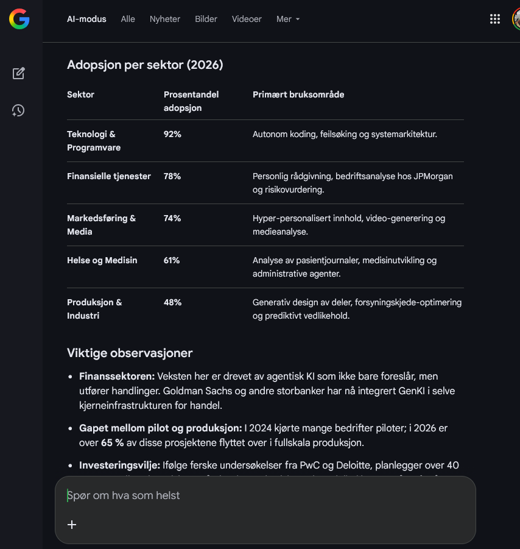

(Tror kilden er <https://www.harbourfrontwealth.com/2026/02/20/ai-trends-2026/>)

Observasjoner for seksjon K (64–66 Finansierings- og forsikringsvirksomhet) er skjult i tabell 13265.

Vi vet at dette er en bransje som er veldig KI-aktiv i følge mange kilder - Vi konstruerer derfor en syntetisk serie for finanssektoren basert på utviklingen i seksjon J (58–63 Informasjon og kommunikasjon).

Denne imputeringen bygger på en strukturell antakelse om at sektorene J og K har lik teknologisk respons på generativ KI. Begge næringer er kunnskapsintensive tjenestesektorer hvor verdiskaping i stor grad skjer gjennom informasjonsbehandling, analyse, beslutningsstøtte og digital infrastruktur. Generativ KI virker primært gjennom effektivisering av slike oppgaver. Det er derfor ikke urimelig å anta at den dynamiske adopsjonsbanen for KI i finanssektoren følger et mønster som ligner utviklingen i informasjonssektoren.

Formelt antar vi felles dynamikk i adopsjonsutviklingen:

$\Delta KI_{K,t} \approx \Delta KI_{J,t}$

Det vil si at endringen i KI-bruk over tid antas å være likartet i de to sektorene, selv om nivåforskjeller kan eksistere. Eventuelle strukturelle nivåforskjeller kan uttrykkes som:

$KI_{K,t} = KI_{J,t} + \delta$

der $\delta$ representerer et konstant avvik mellom sektorene.

Denne tilnærmingen innebærer ikke at sektorene er identiske, men at deres teknologiske komplementaritet til generativ KI er tilstrekkelig lik til at informasjonssektoren gir et informativt anslag på utviklingen i finanssektoren. Antakelsen støttes av ekstern evidens som viser at KI-adopsjon i finans og informasjon beveger seg tett sammen internasjonalt - Gitt finans-**Norge** er med på KI-trenden (Niolai Tangen kilde?)

I Datasettet observerer vi NA's markert på prikkenivå - I følge google sier den dette

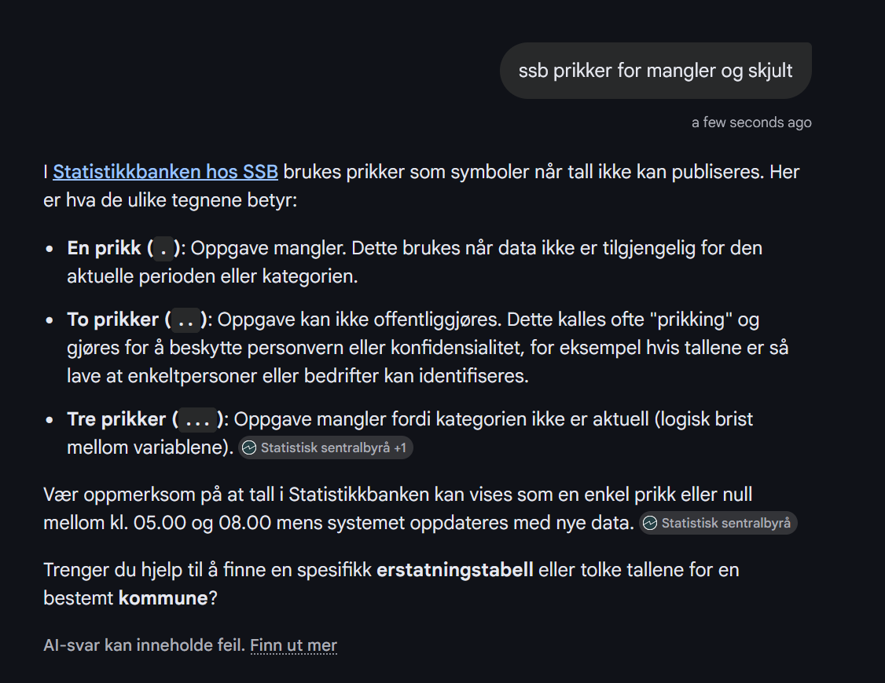{width="462"}

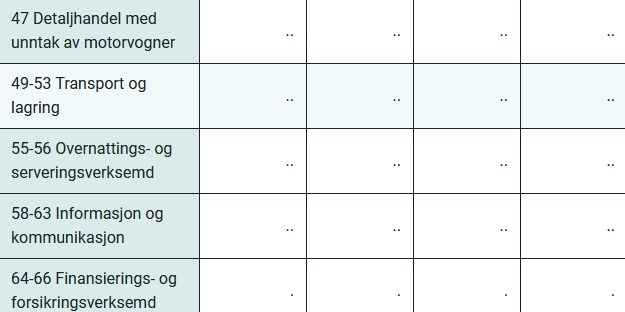{width="450"}

Jeg har lastet ned brukermanualen

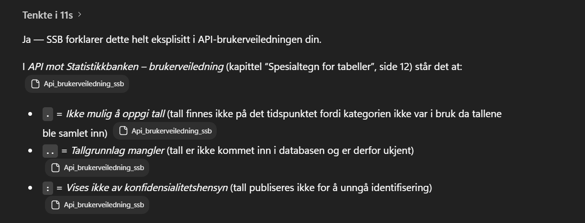

Så vi dealer altså med to forskjellige typer NA's

Noe som gjør at vi beholder samme NA mønster i begge seriene

Copy $K_t=J_t$ ; Add $K=clip(J+δ)$; Scale $K=clip(γJ)$ ; Lag/lead $K_t=J\_{t−ℓ}$; $Δ$: $K_t=K\_{t−1}+(J_t−J\_{t−1})$; Panel FE/RE; Kalman; MI; Synth.

### 68–74 + 77–82 + 95.1 Annen tjenesteyting (SN2007 / NACE Rev. 2)

Tabell 13265 inneholder to brede samlegrupper for **annen tjenesteyting**. Disse er konstruert av flere 2-sifrede næringskoder og brukes av SSB for å gi mer stabile estimater når enkeltkoder har små utvalg.

#### 68–74 + 77–82 + 95.1 Annen tjenesteyting, **unntatt** veterinærtjenester

Dekker i hovedsak:

-   **68 Eiendomsvirksomhet**
-   **69–71 Juridiske og regnskapsmessige tjenester, hovedkontor/ledelse, arkitekt/ingeniør, teknisk testing**
-   **72 Forskning og utviklingsarbeid**
-   **73 Annonse- og reklamevirksomhet, markedsundersøkelser**
-   **74 Annen faglig, vitenskapelig og teknisk virksomhet**
-   **77–82 Forretningsmessig tjenesteyting** (utleie/leasing, bemanning, reisebyrå, vakttjenester, renhold/eiendomsdrift, kontorstøtte/callsenter m.m.)
-   **95.1 Reparasjon av datamaskiner og kommunikasjonsutstyr**

> *Veterinærtjenester (75) er eksplisitt ekskludert i denne gruppen.*

#### 68–75 + 77–82 + 95.1 Annen tjenesteyting, **inkludert** veterinærtjenester

Samme innhold som over, men her inngår også:

-   **75 Veterinærtjenester**

Dette betyr i praksis at vi kun har data for KI og veterinærtjenester.

#### Merknad om prikker/NA i tabellen

I Statbank kan manglende/ikke-publiserte verdier vises med spesialtegn (f.eks. `.` / `..` / `:`). I API-uttrekk blir slike celler typisk til `NA`. Dette skal tolkes som *ikke tilgjengelig/publisert* (ikke som null).

### Variablene 

### **Bruker en eller flere kunstig intelligens-teknologier**

Dette er en **omfangsindikator**: andelen virksomheter som oppgir at de har tatt i bruk minst én KI-teknologi. Variabelen er best å lese som et mål på **diffusjon/adopsjon**, ikke “intensitet”. Å være i gruppen “bruker KI” kan dekke alt fra sporadisk bruk av et verktøy til integrerte KI-løsninger i kjernesystemer. I praksis fungerer denne variabelen som et **taksameter på hvor langt KI har spredd seg** i næringen, og den er ofte det mest stabile målet for å sammenligne næringer over tid.

Metodisk viktig: fordi dette er en “minst én”-indikator kan den ikke brytes ned additivt på underkategoriene – den er ikke sum av bruksområdene, men en **union** (bedrifter kan være med på flere bruksområder samtidig

###  **Tekstanalyse (text mining)**

Denne variabelen fanger KI brukt til å **ekstrahere struktur og signal fra tekst**. Intuitivt: der mennesker tidligere måtte “lese seg gjennom” store tekstmengder (e-poster, dokumenter, kundedialog, saksbehandling, rapporter), kan KI nå gjøre deler av arbeidet ved å:

-   sortere og kategorisere tekst (klassifisering/triagering),

-   identifisere tema, risiko, avvik eller sentiment,

-   trekke ut nøkkelord/enheter (navn, steder, produkter),

-   lage sammenstillinger på tvers av mange dokumenter.

Tekstanalyse er typisk knyttet til **informasjonstunge prosesser** og gir ofte gevinster i form av lavere søkekostnader og raskere beslutningsstøtte. Økonomisk er dette en teknologi som først og fremst øker produktiviteten i “clerical/analytical tasks” – ikke ved å produsere nytt innhold, men ved å **komprimere informasjonskostnaden**.

Begrensning: variabelen sier at bedriften “bruker KI til tekstanalyse”, men ikke hvor avansert (enkle nøkkelordsmodeller vs moderne språkmodeller), og heller ikke hvor integrert det er i produksjonsflyt.

### **Konvertering av talespråk til maskinlesbart format (talegjenkjenning)**

Dette er et mål på bruk av KI til å **gjøre tale om til tekst/data** (speech-to-text). Intuitivt er dette teknologien som tar muntlig kommunikasjon og gjør den **søkbart, arkiverbart og prosesserbart**:

-   transkribering av møter og samtaler,

-   dokumentasjon i helse/forvaltning/kundesenter,

-   automatisk journalføring,

-   strukturering av taledata for videre analyse.

Økonomisk er talegjenkjenning en “bro” mellom muntlig og skriftlig informasjonsbehandling: den reduserer friksjon i dokumentasjon og gjør at tale kan inngå i digitale prosesser (søk, kvalitetssikring, etterprøvbarhet). Den er derfor ofte en forløper til mer avansert automatisering: når tale først er gjort til tekst, kan den videre behandles av tekstanalyse eller generativ KI.

Begrensning: den måler **tilstedeværelse av funksjonen**, ikke kvalitet (ordfeilrate), språkstøtte eller om bedriften bruker det i kritiske beslutninger.

### **Generering av skriftspråk eller talespråk (generering av naturlig språk)**

Dette er den mest direkte variabelen for **generativ KI i tekstdomene**. Den fanger virksomheter som bruker KI til å *produsere* språkinnhold, ikke bare analysere det. Intuitivt: der tekstanalyse handler om å “lese og forstå” tekst i stor skala, handler denne om å “skrive og formulere” på kommando.

Typiske bruksflater:

-    utkast til e-poster, rapporter, saksnotat, markedsføringstekst

-   oppsummering og omformulering (inkl. stil/tilpasning)

-   kundedialog/chatbots og intern støtte (FAQ, HR, IT)

-   oversettelse og språktilpasning

-   generering av kodekommentarer/teknisk dokumentasjon (i IT-nære virksomheter)

Økonomisk kanal: Denne variabelen treffer særlig “language-heavy tasks” og kan gi produktivitetsgevinster gjennom:

-   lavere tid per tekstproduksjon (høy frekvens, lavere marginalkostnad),

-   mer standardisering (maler, konsistente formuleringer),

-   skalering av kommunikasjon (én ansatt kan håndtere flere henvendelser).

Begrensning: “bruk” kan være alt fra sporadisk bruk av ChatGPT-lignende verktøy til full integrasjon i arbeidsflyt. Variabelen sier heller ikke noe om kvalitetssikring/humans-in-the-loop, som er avgjørende for reell produktivitetsgevinst og risiko.

###  **Maskinlæring (f.eks. dyp læring) for dataanalyse**

Dette er den mest “generiske” KI-variabelen i tabellen: den fanger virksomheter som bruker maskinlæring til å **finne mønstre i data og lage prediksjoner/klassifiseringer**. Intuitivt: det er KI som gjør statistisk modellering mer fleksibel når sammenhenger er komplekse (ikke-lineære, høydimensjonale).

Typiske bruksflater:

-   prediksjon (etterspørsel, churn, mislighold, lager)

-   klassifisering og scoring (risiko, svindel, segmentering)

-   anomalideteksjon (avvik i transaksjoner/produksjon)

-   anbefalingssystemer (produkter, innhold, tiltak)

Økonomisk kanal: dette treffer særlig **analytiske oppgaver** og kan øke produktivitet gjennom bedre beslutningsgrunnlag (høyere kvalitet per beslutning) og automatisert triagering. Gevinsten kan være stor, men er ofte mer “system-/modellavhengig” enn ved generativ tekst: du må ha data, pipeline, vedlikehold og governance.

Begrensning: variabelen sier ikke om bruken er “en enkel modell i Excel” vs et produksjonsklart ML-system. Den sier heller ikke om modellen er intern eller kjøpt, eller om den faktisk endrer beslutninger (adopsjon ≠ effekt).

Begrensning: variabelen sier ikke om bruken er “en enkel modell i Excel” vs et produksjonsklart ML-system. Den sier heller ikke om modellen er intern eller kjøpt, eller om den faktisk endrer beslutninger (adopsjon ≠ effekt).

### **Automatisering av arbeidsflyter eller beslutningsstøtte**

Dette er en “produksjonsnær” variabel: den sier at KI brukes til å **flytte arbeid fra mennesker til system**, eller til å støtte valg (prioritering, forslag, anbefaling). Intuitivt: KI som knytter analyse til handling i prosessen.

Typiske bruksflater:

-   saksbehandling (forslag til vedtak, triage, dokumentutkast + kontroll)

-   kundesenter (routing, svarforslag, oppsummering)

-   intern prosess: HR/innkjøp/IT (ticket-triage, avviksbehandling)

-   beslutningsstøtte i drift (hva bør gjøres først, hva er sannsynlig problem)

Økonomisk kanal: dette er ofte der produktivitetsgevinster “materialiserer seg”, fordi man sparer tid direkte i arbeidsflyten (gjennomløpstid, færre manuelle steg). I en oppgave-/task-ramme er dette nært “automatisering av oppgaver”.

Begrensning: variabelen er teknologinøytral – den kan være alt fra regelmotor + enkel ML til LLM-basert agentstøtte. Den sier heller ikke hvor “hands-off” automatiseringen er (fullautomatisert vs human-in-the-loop)

### **Automatisering av arbeidsflyter eller beslutningsstøtte**

Dette er en “produksjonsnær” variabel: den sier at KI brukes til å **flytte arbeid fra mennesker til system**, eller til å støtte valg (prioritering, forslag, anbefaling). Intuitivt: KI som knytter analyse til handling i prosessen.

Typiske bruksflater:

-   saksbehandling (forslag til vedtak, triage, dokumentutkast + kontroll)

-   kundesenter (routing, svarforslag, oppsummering)

-   intern prosess: HR/innkjøp/IT (ticket-triage, avviksbehandling)

-   beslutningsstøtte i drift (hva bør gjøres først, hva er sannsynlig problem)

Økonomisk kanal: dette er ofte der produktivitetsgevinster “materialiserer seg”, fordi man sparer tid direkte i arbeidsflyten (gjennomløpstid, færre manuelle steg). I en oppgave-/task-ramme er dette nært “automatisering av oppgaver”.

Begrensning: variabelen er teknologinøytral – den kan være alt fra regelmotor + enkel ML til LLM-basert agentstøtte. Den sier heller ikke hvor “hands-off” automatiseringen er (fullautomatisert vs human-in-the-loop)

## Koder

```{r}
library(readr)
library(dplyr)
library(tidyr)
library(pxweb)
library(PxWebApiData)
library(jsonlite)
library(rjstat)
library(stringr)


```

### 13265

```{r}
url_13265 <- "https://data.ssb.no/api/pxwebapi/v2/tables/13265/data?lang=no&outputFormat=json-stat2&valuecodes[ContentsCode]=*&valuecodes[Tid]=*&valuecodes[NACE2007]=*&valuecodes[SyssGrpIKT]=*&stub=NACE2007,SyssGrpIKT,Tid,ContentsCode"

ai <- rjstat::fromJSONstat(url_13265)  # <-- direkte URL inn hit

names(ai)
```

```{r}

#readr::write_csv(ai, "ai.csv")

```

```{r}


names(ai) <- c("industri", "sysselsatte", "year", "variabel", "value")
ai$year <- as.integer(ai$year)


```

```{r}

#readr::write_csv(ai, "ai.csv")

```

```{r}
# (1) Rydd litt whitespace først (valgfritt men smart)
ai <- ai %>%
  mutate(industri = str_squish(as.character(industri)))

# (2) Se alle unike industrinavn, sortert
industri_list <- ai %>%
  distinct(industri) %>%
  arrange(industri)

industri_list
```

```{r}
# Først: rydd whitespace
ai <- ai %>%
  mutate(industri = str_squish(industri))

# Recode til bokmål
ai <- ai %>%
  mutate(
    industri = recode(industri,
      
      # Aggregater
      "Alle næringer, inkludert finansnæringene" = "Alle næringer, inkludert finansnæringen",
      "Alle næringer, uten finansnæringene"      = "Alle næringer, uten finansnæringen",
      
      # Finans
      "Finansierings- og forsikringsverksemd" = "Finansierings- og forsikringsvirksomhet",
      
      # Industri-blokk
      "Industri, kraftforsyning, vatn, avløp og renovasjon" =
        "Industri, kraftforsyning, vann, avløp og renovasjon",
      
      # Bygg
      "Byggje- og anleggsverksemd" = "Bygge- og anleggsvirksomhet",
      
      # Tjenester
      "Anna tenesteyting, inklusive veterinærtenester" =
        "Annen tjenesteyting, inkludert veterinærtjenester",
      
      "Anna tenesteyting, unntatt veterinærtenester" =
        "Annen tjenesteyting, unntatt veterinærtjenester",
      
      # Handel
      "Agentur- og engroshandel med unntak av motorvogner" =
        "Agentur- og engroshandel, unntatt motorvogner",
      
      "Detaljhandel med unntak av motorvogner" =
        "Detaljhandel, unntatt motorvogner",
      
      # Overnatting
      "Overnattings- og serveringsverksemd" =
        "Overnattings- og serveringsvirksomhet",
      
      .default = industri
    )
  )

# Sjekk resultat
sort(unique(ai$industri))
```

```{r}
# 0) Rydd whitespace i tekstkolonner
ai <- ai %>%
  mutate(
    sysselsatte = str_squish(sysselsatte),
    variabel    = str_squish(variabel)
  )

# 1) Bokmål for sysselsatte (bedriftsstørrelse)
ai <- ai %>%
  mutate(
    sysselsatte = recode(sysselsatte,
      "Alle sysselsette"            = "Alle sysselsatte",
      "10-19 sysselsette"           = "10–19 sysselsatte",
      "20-49 sysselsette"           = "20–49 sysselsatte",
      "50-99 sysselsette"           = "50–99 sysselsatte",
      "100 sysselsette eller fleire"= "100(+) sysselsatte ",
      .default = sysselsatte
    )
  )
```

```{r}
ai <- ai %>%
  mutate(
    sysselsatte = str_squish(as.character(sysselsatte)),
    variabel    = str_squish(as.character(variabel))
  ) %>%
  mutate(
    # Bokmal: sysselsatte
    sysselsatte = case_when(
      str_detect(sysselsatte, regex("^Alle", ignore_case = TRUE)) ~ "Alle sysselsatte",
      str_detect(sysselsatte, regex("^10\\s*[-\\u2013]\\s*19", ignore_case = TRUE)) ~ "10\u201319 sysselsatte",
      str_detect(sysselsatte, regex("^20\\s*[-\\u2013]\\s*49", ignore_case = TRUE)) ~ "20\u201349 sysselsatte",
      str_detect(sysselsatte, regex("^50\\s*[-\\u2013]\\s*99", ignore_case = TRUE)) ~ "50\u201399 sysselsatte",
      str_detect(sysselsatte, regex("^100", ignore_case = TRUE)) ~ "100 sysselsatte eller flere",
      TRUE ~ sysselsatte
    ),

    # Bokmal: variabel (robust matching, ingen lange eksakte strenger)
    variabel = case_when(
      str_detect(variabel, regex("^Brukar ein eller fleire", ignore_case = TRUE)) ~
        "Bruker en eller flere kunstig intelligens-teknologier",

      str_detect(variabel, regex("^Tekstanalyse", ignore_case = TRUE)) ~
        "Tekstanalyse (text mining)",

      str_detect(variabel, regex("talegjenkjenning", ignore_case = TRUE)) ~
        paste0("Konvertering av talespr", "\u00e5", "k til maskinlesbart format (talegjenkjenning)"),

      str_detect(variabel, regex("Generering.*skriftspr|generering av natur", ignore_case = TRUE)) ~
        paste0("Generering av skriftspr", "\u00e5", "k eller talespr", "\u00e5",
               "k (generering av naturlig spr", "\u00e5", "k)"),

      str_detect(variabel, regex("Generering.*bilete|Generering.*video|Generering.*lyd", ignore_case = TRUE)) ~
        "Generering av bilder, video, lyd/audio",

      str_detect(variabel, regex("biletgjenkjenning|bildegjenkjenning", ignore_case = TRUE)) ~
        "Identifisering av objekter eller personer basert på bilder (bildegjenkjenning)",

      str_detect(variabel, regex("^Maskinl", ignore_case = TRUE)) ~
        paste0("Maskinl", "\u00e6", "ring (f.eks. dyp l", "\u00e6", "ring) for dataanalyse"),

      str_detect(variabel, regex("^Automatisering", ignore_case = TRUE)) ~
        paste0("Automatisering av arbeidsflyter eller beslutningsst", "\u00f8", "tte"),

      str_detect(variabel, regex("fysisk|autonom|robot|dron|sj\\u00f8lvk", ignore_case = TRUE)) ~
        paste0("Muliggj", "\u00f8", "r fysisk bevegelse av maskiner via autonome beslutninger ",
               "(autonome roboter/droner, selvkj", "\u00f8", "rende kj", "\u00f8", "ret", "\u00f8", "y)"),

      TRUE ~ variabel
    )
  )
```

```{r}
# Sjekk
sort(unique(ai$sysselsatte))
```

```{r}
sort(unique(ai$variabel))


```

```{r}
ai <- ai %>%
  mutate(
    variabel = str_squish(as.character(variabel))
  ) %>%
  mutate(
    variabel = str_replace(
      variabel,
      regex("^Identifisering av objekt.*bildegjenkjenning\\)$"),
      paste0(
        "Identifisering av objekter eller personer basert p",
        "\u00E5",
        " bilder (bildegjenkjenning)"
      )
    )
  )
```

```{r}
sort(unique(ai$variabel))

```

```{r}
# 2) Fiks sysselsatte-labels til ASCII (bruk '-' i stedet for rar dash)
ai <- ai %>%
  mutate(
    sysselsatte = case_when(
      str_detect(sysselsatte, regex("^Alle", ignore_case = TRUE)) ~ "Alle sysselsatte",
      str_detect(sysselsatte, regex("^10",   ignore_case = TRUE)) ~ "10-19 sysselsatte",
      str_detect(sysselsatte, regex("^20",   ignore_case = TRUE)) ~ "20-49 sysselsatte",
      str_detect(sysselsatte, regex("^50",   ignore_case = TRUE)) ~ "50-99 sysselsatte",
      str_detect(sysselsatte, regex("^100",  ignore_case = TRUE)) ~ "100 sysselsatte eller flere",
      TRUE ~ sysselsatte
    )
  )

```

```{r}


sort(unique(ai$sysselsatte))    
     
     
```

Copy $K_t=J_t$ ; Add $K=clip(J+δ)$; Scale $K=clip(γJ)$ ; Lag/lead $K_t=J\_{t−ℓ}$; $Δ$: $K_t=K\_{t−1}+(J_t−J\_{t−1})$; Panel FE/RE; Kalman; MI; Synth.

-   Vi kan komme tilbake til dette når vi har gjort mer forskning å se på imputisjon med bakgrunn i bootstrao/ml

```{r}
set.seed(123)  # reproduserbarhet

INFO <- "Informasjon og kommunikasjon"
FIN  <- "Finansierings- og forsikringsvirksomhet"

clamp_0_100 <- function(x) pmin(100, pmax(0, x))

# Lager en alternativ tidsbane som har:
# - samme snitt (mean)
# - samme varians (sample variance, via samme sum of squares rundt mean)
# - samme sluttverdi (siste ikke-NA)
# - men litt annerledes mellompunkter
alt_path_same_moments <- function(y) {
  idx <- which(!is.na(y))
  n <- length(idx)
  if (n < 4) return(y)  # for få frihetsgrader til å gjøre noe "pent" (3 kan være låst)

  yy <- y[idx]
  m  <- mean(yy)
  d  <- yy - m
  d_end <- d[n]

  k <- n - 1
  u0 <- d[1:k]

  # velg a parallell med 1-vektor slik at sum(u) = -d_end
  a <- rep(-d_end / k, k)            # sum(a) = -d_end
  v0 <- u0 - a                       # sum(v0) = 0
  v0norm <- sqrt(sum(v0^2))
  if (v0norm < 1e-12) return(y)      # ingen frihet -> beholder original

  # konstruer en ny v1 i sum=0-subrommet med samme norm som v0 (rotasjon)
  # og velg en liten rotasjon for å holde oss innen [0,100]
  for (attempt in 1:200) {
    # tilfeldig retning i subrommet sum=0
    z <- rnorm(k)
    z <- z - mean(z)

    # fjern komponent langs v0 (så vi får en "ny" retning)
    proj <- sum(z * v0) / sum(v0^2)
    w <- z - proj * v0
    wnorm <- sqrt(sum(w^2))
    if (wnorm < 1e-8) next
    w <- w / wnorm

    # liten vinkel -> "litt annerledes"
    theta <- runif(1, 0.10, 0.60)
    v1 <- cos(theta) * v0 + sin(theta) * w * v0norm

    u1 <- a + v1
    d_new <- c(u1, d_end)            # sluttdeviasjon lik original
    yy_new <- m + d_new

    # holde prosentgrenser
    if (min(yy_new) >= 0 && max(yy_new) <= 100) {
      y_new <- y
      y_new[idx] <- yy_new
      return(y_new)
    }
  }

  # fallback: hvis vi aldri finner innen bounds
  y
}

# 0) Rydd og gjør INFO unik per (sysselsatte, year, variabel) for å unngå join-trøbbel
ai <- ai %>%
  mutate(
    industri    = str_squish(as.character(industri)),
    sysselsatte = str_squish(as.character(sysselsatte)),
    variabel    = str_squish(as.character(variabel)),
    year        = as.integer(year),
    value       = as.numeric(value)
  )

J_unique <- ai %>%
  filter(industri == INFO) %>%
  group_by(sysselsatte, year, variabel) %>%
  summarise(
    value = if (all(is.na(value))) NA_real_ else mean(value, na.rm = TRUE),
    .groups = "drop"
  )

# 1) Bygg ny FIN-serie: samme mean/var/sluttverdi per (sysselsatte, variabel), men annen bane
K_new <- J_unique %>%
  group_by(sysselsatte, variabel) %>%
  arrange(year, .by_group = TRUE) %>%
  group_modify(~{
    y <- .x$value
    yk <- alt_path_same_moments(y)
    tibble(year = .x$year, value = yk)
  }) %>%
  ungroup() %>%
  mutate(
    industri = FIN,
    value = clamp_0_100(value),
    constructed_fin = TRUE
  ) %>%
  select(industri, sysselsatte, year, variabel, value, constructed_fin)

# 2) Sett inn FIN på nytt i datasettet (fjerner gammel FIN og legger inn ny)
ai2 <- ai %>%
  filter(industri != FIN) %>%
  bind_rows(K_new)

# 3) (valgfritt) Kontroller at momentene matcher for hver (sysselsatte, variabel)
check <- ai2 %>%
  filter(industri %in% c(INFO, FIN)) %>%
  group_by(industri, sysselsatte, variabel) %>%
  summarise(
    mean = mean(value, na.rm = TRUE),
    var  = var(value, na.rm = TRUE),
    last = dplyr::last(value[!is.na(value)]),
    .groups = "drop"
  ) %>%
  pivot_wider(names_from = industri, values_from = c(mean, var, last))

check
```

```{r}
glimpse(ai2)
```

```{r}

INFO <- "Informasjon og kommunikasjon"
FIN  <- "Finansierings- og forsikringsvirksomhet"

compare_df <- ai2 %>%
  filter(industri %in% c(INFO, FIN),
         sysselsatte == "Alle sysselsatte") %>%
  select(industri, sysselsatte, year, variabel, value) %>%
  pivot_wider(names_from = industri, values_from = value) %>%
  arrange(variabel, year)

compare_df
```

```{r}

moment_check <- ai2 %>%
  filter(industri %in% c(INFO, FIN),
         sysselsatte == "Alle sysselsatte") %>%
  group_by(industri, variabel) %>%
  summarise(
    mean = mean(value, na.rm = TRUE),
    var  = var(value, na.rm = TRUE),
    last = dplyr::last(value[!is.na(value)]),
    .groups = "drop"
  ) %>%
  pivot_wider(names_from = industri,
              values_from = c(mean, var, last))

moment_check


```

```{r}
FIN  <- "Finansierings- og forsikringsvirksomhet"

ai2 <- ai2 %>%
  mutate(
    value = if_else(
      industri == FIN & !is.na(value),
      round(value, 0),
      value
    )
  )
```

```{r}
compare_df <- ai2 %>%
  filter(industri %in% c(INFO, FIN),
         sysselsatte == "Alle sysselsatte") %>%
  select(industri, sysselsatte, year, variabel, value) %>%
  pivot_wider(names_from = industri, values_from = value) %>%
  arrange(variabel, year)

compare_df


```

```{r}
moment_check <- ai2 %>%
  filter(industri %in% c(INFO, FIN),
         sysselsatte == "Alle sysselsatte") %>%
  group_by(industri, variabel) %>%
  summarise(
    mean = mean(value, na.rm = TRUE),
    var  = var(value, na.rm = TRUE),
    last = dplyr::last(value[!is.na(value)]),
    .groups = "drop"
  ) %>%
  pivot_wider(names_from = industri,
              values_from = c(mean, var, last))

moment_check


```

```{r}
library(dplyr)

INFO <- "Informasjon og kommunikasjon"

# 1) Hele tallserien for Info/Kom (sortert)
info_series <- ai %>%
  filter(industri == INFO) %>%
  arrange(sysselsatte, variabel, year) %>%
  select(sysselsatte, variabel, year, value)

info_series
```

### koder senere

```{r}
# 0) URL (din)
url_09174 <- "https://data.ssb.no/api/pxwebapi/v2/tables/09174/data?lang=no&outputFormat=json-stat2&valuecodes[Tid]=2000,2001,2002,2003,2004,2005,2006,2007,2008,2009,2010,2011,2012,2013,2014,2015,2016,2017,2018,2019,2020,2021,2022,2023,2024,2025&valuecodes[NACE]=*&codelist[NACE]=vs_NRNaeringPubAgg&valuecodes[ContentsCode]=*&heading=Tid,ContentsCode&stub=NACE"

# 1) Last inn
nr_raw <- rjstat::fromJSONstat(url_09174)


# 2) Finn faktiske kolonnenavn (robust)
nms <- names(nr_raw)


```

j

```{r}
names(nr_raw)
```

```{r}

# --- 0) Mappe til data ---
dir.create("data", showWarnings = FALSE)

# --- 1) URLer (fra deg) ---
url_09181 <- "https://data.ssb.no/api/pxwebapi/v2/tables/09181/data?lang=no&outputFormat=json-stat2&valuecodes[Tid]=2000,2001,2002,2003,2004,2005,2006,2007,2008,2009,2010,2011,2012,2013,2014,2015,2016,2017,2018,2019,2020,2021,2022,2023,2024,2025&valuecodes[NACE]=*&codelist[NACE]=vs_NRNaeringPubAgg&valuecodes[ContentsCode]=*&heading=Tid,ContentsCode&stub=NACE"

url_07967 <- "https://data.ssb.no/api/pxwebapi/v2/tables/07967/data?lang=no&outputFormat=json-stat2&valuecodes[ContentsCode]=*&valuecodes[Tid]=*&valuecodes[SyssGrp]=*&valuecodes[NACE2007]=*&heading=Tid,ContentsCode&stub=NACE2007,SyssGrp"

url_07970 <- "https://data.ssb.no/api/pxwebapi/v2/tables/07970/data?lang=no&outputFormat=json-stat2&valuecodes[ContentsCode]=*&valuecodes[Tid]=*&valuecodes[SysselsettGr]=*&valuecodes[NACE2007]=*&heading=Tid,ContentsCode&stub=NACE2007,SysselsettGr"

url_07968 <- "https://data.ssb.no/api/pxwebapi/v2/tables/07968/data?lang=no&outputFormat=json-stat2&valuecodes[ContentsCode]=*&valuecodes[Tid]=*&valuecodes[SyssGrp]=*&valuecodes[NACE2007]=*&heading=Tid,ContentsCode&stub=NACE2007,SyssGrp"

# --- 2) Laste-funksjon ---
load_ssb <- function(url, object_name, save_path){
  message("\n--- Laster: ", object_name, " ---")
  df <- rjstat::fromJSONstat(url)
  message("dim = ", paste(dim(df), collapse = " x "))
  message("kolonner: ", paste(names(df), collapse = " | "))
  saveRDS(df, save_path)
  message("lagret: ", save_path)
  df
}

# --- 3) Hent alt inn ---
k_raw       <- load_ssb(url_09181, "09181 (kapital/investering)", "data/ssb_09181_kapital.rds")
rd_intra_raw<- load_ssb(url_07967, "07967 (egenutført FoU)",       "data/ssb_07967_rd_intra.rds")
rd_buy_raw  <- load_ssb(url_07970, "07970 (innkjøpt FoU)",         "data/ssb_07970_rd_buy.rds")
rd_staff_raw<- load_ssb(url_07968, "07968 (FoU-personale/årsverk)","data/ssb_07968_rd_staff.rds")

```

```{r}

names(nr_raw)
names(k_raw)
names(rd_intra_raw)
names(rd_buy_raw)
names(rd_staff_raw)

```

# Tekst

## Det makroøkonomsike

I papiret *Simple Macroeconomics of ai* avgir Acemoglu følgende produksjonsfunksjon

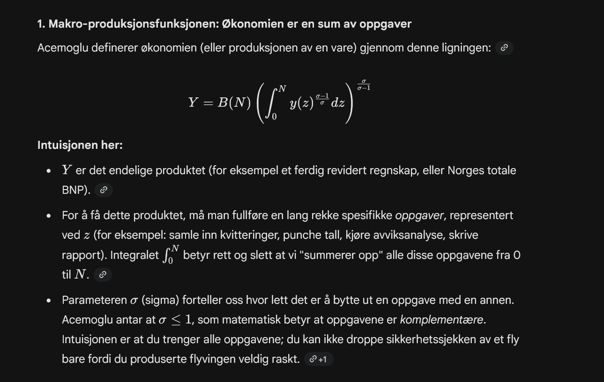


Ligningen sier at en spesifikk oppgave z kan gjøres *enten* av mennesker (l) eller av maskiner/KI (k)

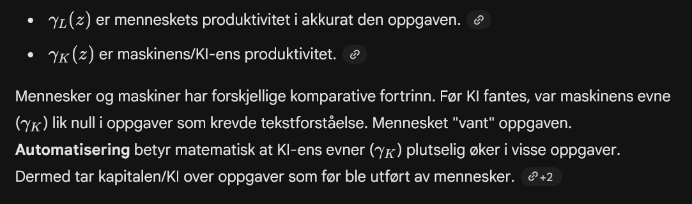

Produksjonen $y(z)$ er altså i forandring

### Hultens Teorem

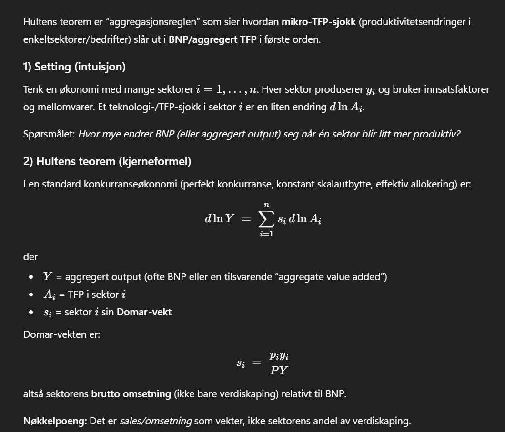

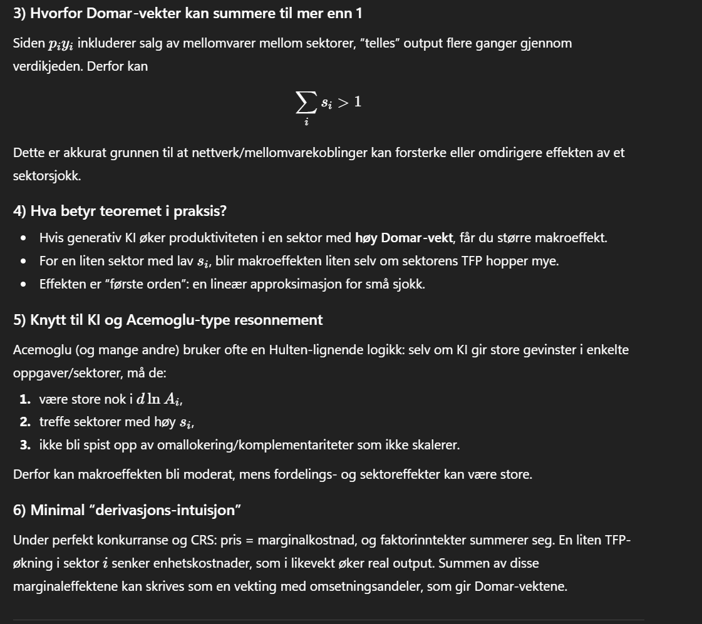

## Det mikroøkonomiske

Mens det forrige papiret (fra 2024/2025 (to versjoner via oria)) handlet om *hvor mye* kaken (BNP/produktiviteten) vil vokse av KI, handler dette Econometrica-papiret fra 2022 (Acemoglu & Restrepo) om hvordan kaken deles, og hvorfor noen taper mens andre vinner.

papiret introduserer matten som forklarer hvorfor teknologi faktisk kan gjøre bestemte grupper **fattigere**.

Her er den matematiske intuisjonen, steg for steg:

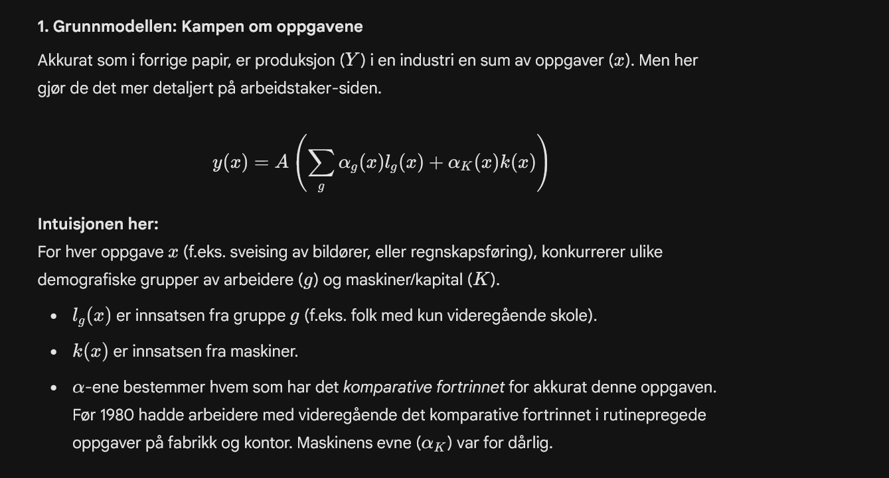

Og idag......

Hva skjer når en ny teknologi introduseres? Acemoglu definerer Automatisering at maskinene plutselig får et komparativt fortrinn i oppgaver som *tidligere* ble utført av mennesker - Han sammenligner autmatisjon i bilindustrien og KI i andre industrier i dag.

Kanskje Task Displacement for en spesifikk gruppe (g). Matten for dette (Ligning 5 i papiret) fanger opp hvor stor andel av gruppe g sin historiske lønnssum som lå i oppgaver som nå er overtatt av maskiner

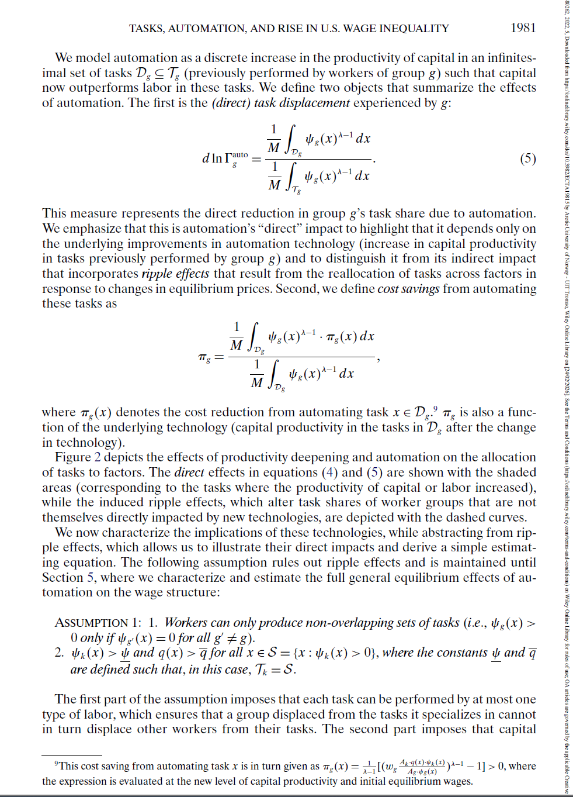](images/clipboard-990618486.png)

General Equilibrium. Acemoglu viser at når en oppgave automatiseres, skjer det kjedereaksjoner:

-   **Sammensetningseffekt:** Hvis bilindustrien automatiserer mye, faller prisene på biler. Folk kjøper flere biler. Bilindustrien vokser og ansetter kanskje *flere* designere og ingeniører, selv om de sparker samlebåndsarbeiderne.

-   Dette forsterker ulikheten: De gruppene som *ikke* ble fortrengt, tjener nå enda mer fordi deres industri vokser.

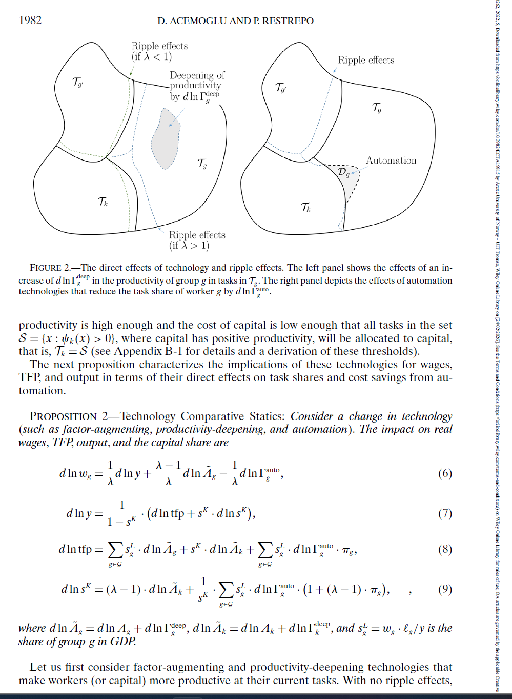](images/clipboard-620164386.png)

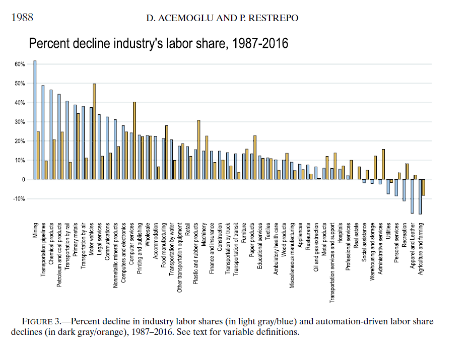

-   analyse av norske data: Forventning gitt teorien; vil finne at det er høyt utdannede funksjonærer (revisorer, saksbehandlere, programmerere, markedsførere) som nå vil få betydelig "Task Displacement" score.

-   side-Spørsmål: Vil produktivitetseffekten i Norge være stor nok til å overgå forskyvningseffekten, eller vil "hvitsnipp"-arbeidere oppleve ligneende reallønnsstagnasjonen som amerikanske fabrikkarbeidere opplevde på 90-tallet?

### 68–74 + 77–82 + 95.1 Annen tjenesteyting (SN2007 / NACE Rev. 2)

Tabell 13265 inneholder to brede samlegrupper for **annen tjenesteyting**. Disse er konstruert av flere 2-sifrede næringskoder og brukes av SSB for å gi mer stabile estimater når enkeltkoder har små utvalg.

#### 68–74 + 77–82 + 95.1 Annen tjenesteyting, **unntatt** veterinærtjenester

Dekker i hovedsak:

-   **68 Omsetning og drift av fast eiendom**
-   **69–71 Juridiske og regnskapsmessige tjenester, hovedkontor/ledelse, arkitekt/ingeniør, teknisk testing**
-   **72 Forskning og utviklingsarbeid**
-   **73 Annonse- og reklamevirksomhet, markedsundersøkelser**
-   **74 Annen faglig, vitenskapelig og teknisk virksomhet**
-   **77–82 Forretningsmessig tjenesteyting** (utleie/leasing, bemanning, reisebyrå, vakttjenester, renhold/eiendomsdrift, kontorstøtte/callsenter m.m.)
-   **95.1 Reparasjon av datamaskiner og kommunikasjonsutstyr**

> *Veterinærtjenester (75) er eksplisitt ekskludert i denne gruppen.*

#### 68–75 + 77–82 + 95.1 Annen tjenesteyting, **inkludert** veterinærtjenester

Samme innhold som over, men her inngår også:

-   **75 Veterinærtjenester**

#### Merknad om prikker/NA i tabellen

I Statbank kan manglende/ikke-publiserte verdier vises med spesialtegn (f.eks. `.` / `..` / `:`). I API-uttrekk blir slike celler typisk til `NA`. Dette skal tolkes som *ikke tilgjengelig/publisert* (ikke som null).

# Empirisk Metode

# Konklusjon/Diskusjon

# Appendix

### Tabell 13265 Konstruksjon

## En analytisk gruppering av variablene (som du kan bruke direkte i metode/data)

1.   **Omfang (diffusjon):**

    Bruker én eller flere KI-teknologier\
    Dette er “headline”-målet for hvor bred KI-adopsjon er i næringen.

2.   **Generativ KI (innholdsproduksjon):**

    Generering av skriftspråk/talespråk

    Generering av bilder/video/lyd\
    Dette er de mest “rene” GenAI-målene i tabellen.

3.  **Analytisk/prediktiv KI (klassisk ML/NLP/CV):**

    Tekstanalyse

    Talegjenkjenning

    Bildegjenkjenning

    Maskinlæring for dataanalyse\
    Dette fanger KI brukt til å *ekstrahere signal* og *predikere*, ikke produsere nytt innhold.

4.  **Operasjonalisering i prosess (fra innsikt til handling):**

    Automatisering av arbeidsflyter/beslutningsstøtte\
    Dette er ofte der produktivitetsgevinster materialiserer seg (tidsbesparelse i prosess), men variabelen er teknologinøytral.

5.   **Fysisk autonomi (cyber–physical):**

    Autonome beslutninger for fysisk bevegelse\
    Ofte høy implementeringskostnad og derfor mer selektiv adopsjon

# Referanser
